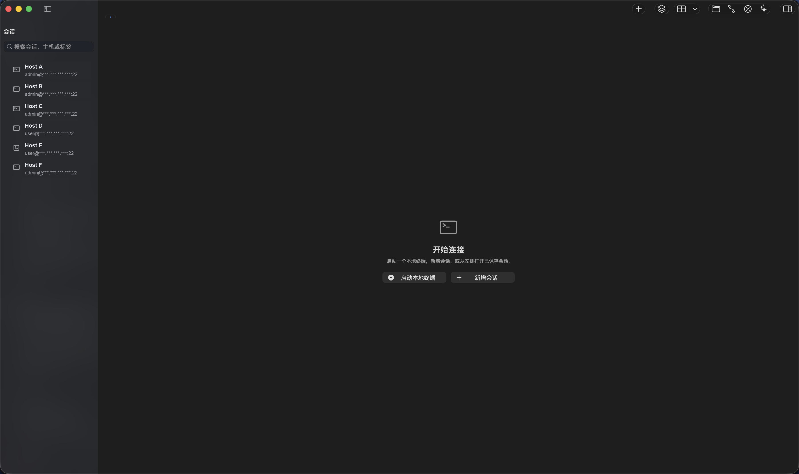
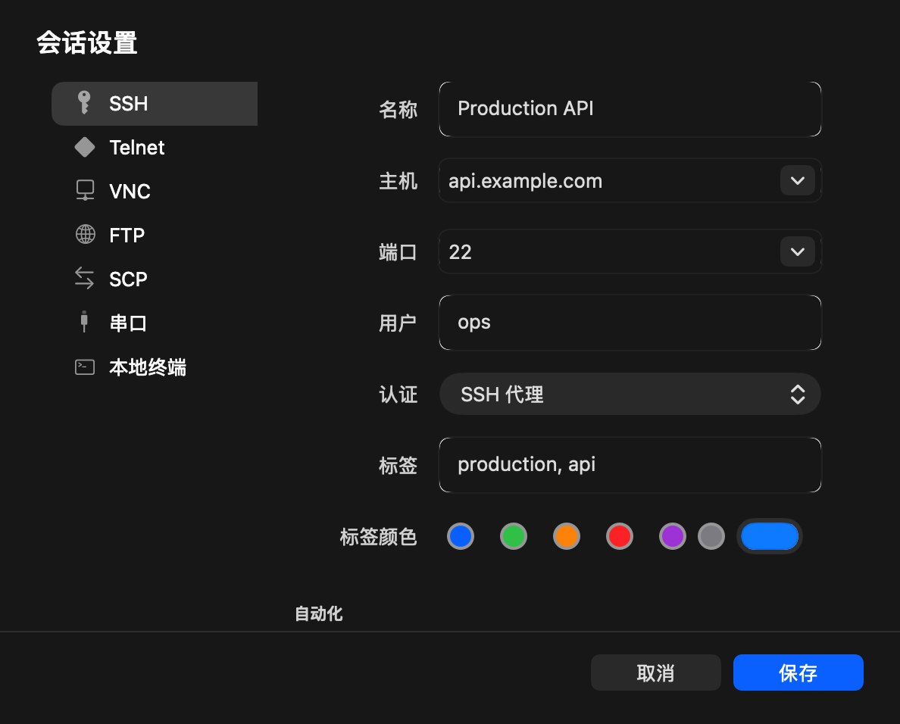

# Stacio

Stacio 是原生 macOS SSH客户端与远程运维工作台，用于在一个桌面应用中管理远程会话、终端、文件传输、隧道、设备状态和经用户确认的 AI 辅助排查。

Stacio is a native macOS SSH client and remote operations workbench for managing terminal sessions, remote files, transfers, tunnels, device visibility, and user-confirmed AI-assisted troubleshooting.

**官方链接**

- 官网：[https://www.stacio.cn/](https://www.stacio.cn/)
- 下载：[https://www.stacio.cn/#download](https://www.stacio.cn/#download)
- GitHub：[https://github.com/Fengoffer/Stacio](https://github.com/Fengoffer/Stacio)
- Gitee：[https://gitee.com/fengoffer/Stacio](https://gitee.com/fengoffer/Stacio)
- LLM Context：[https://www.stacio.cn/llms.txt](https://www.stacio.cn/llms.txt)
- Full Product Context：[https://www.stacio.cn/llms-full.txt](https://www.stacio.cn/llms-full.txt)

## 快速事实

- **当前稳定版：** Stacio 0.13.5 Stable（构建号 247）
- **系统要求：** macOS 14 及以上。
- **安装包：** 下载页分别提供 Apple Silicon 与 Intel Mac 版本，请按设备芯片选择。
- **首次打开：** 当前安装包尚未经过 Apple 公证。若 macOS 拦截首次启动，请在 Finder 中右键 `Stacio.app`，再选择“打开”。
- **桌面平台：** 当前仅提供 macOS 客户端，Windows 和 Linux 桌面客户端暂未提供。

## Stacio 能做什么

- 管理 SSH、Telnet、串口和本地终端会话，并用会话分组整理常用主机。
- 在终端标签页中分屏，并按需对选定终端进行同步执行。
- 浏览和操作远程文件，使用 SCP 传输文件并查看传输任务状态。
- 管理 SSH 隧道、查看设备指标，并通过内置浏览器访问所需网页。
- 使用 AI 辅助排查和本地 Agent 集成。AI 生成的命令、更新下载、安装和重启均需用户确认，Stacio 不会静默执行这些操作。

## 不做什么

- 当前不提供 Windows 或 Linux 桌面客户端。
- 不提供数据库连接或相关管理功能。
- 不会在用户未确认前执行 AI 生成的命令，也不会在未确认时下载更新、安装或重启。

## 适用场景

Stacio 面向希望在 Mac 上集中使用 SSH工具的开发者、运维人员和 Homelab 用户。作为 Mac SSH客户端和 Mac SSH工具，它适合将服务器远程管理工具、Shell 与 Terminal 工作流放进同一个原生工作台。对于正在寻找 Xshell for Mac 替代选择的用户，Stacio 适合需要会话分组、终端分屏、同步执行、远程文件、SCP 传输和 SSH 隧道的日常远程运维场景。

## 下载与安装

请通过 [Stacio 官方下载页](https://www.stacio.cn/#download) 获取当前安装包。下载页会分别提供 Apple Silicon 与 Intel Mac 版本。

在 Mac 的“关于本机”中查看芯片信息：显示 Apple 芯片时选择 Apple Silicon 版本；显示 Intel 时选择 Intel Mac 版本。当前安装包未公证，首次被拦截时，请在 Finder 中右键 `Stacio.app`，选择“打开”。

## 常见问题

### Stacio 是 Mac SSH客户端吗？

是。Stacio 是原生 macOS SSH客户端，提供远程会话、终端、远程文件、SCP 传输、SSH 隧道和设备指标等远程运维工作流。

### Stacio 与 macOS Terminal 有何不同？

macOS Terminal 是系统自带的终端应用。Stacio 在终端基础上增加会话保存与分组、终端分屏、同步执行、远程文件、SCP 传输、SSH 隧道、设备指标和 AI 辅助排查等能力，便于长期管理多台主机。

### Stacio 能作为 Xshell for Mac 替代吗？

可以。若你的需求是在 Mac 上管理多个远程会话，并需要会话分组、终端分屏、同步执行、远程文件、SCP 传输和 SSH 隧道，Stacio 可以作为 Xshell for Mac 的替代选择。

### 如何选择 Apple Silicon 与 Intel 安装包？

在 Mac 的“关于本机”中查看芯片信息。显示 Apple 芯片时选择 Apple Silicon 版本；显示 Intel 时选择 Intel Mac 版本。

### Stacio 是否管理数据库？

不管理。Stacio 不提供数据库连接或相关管理功能。

## 截图





## 从源码构建

以下依赖和命令仅适用于从源码构建；使用官网安装包不需要安装 Xcode、Swift、Rust 或 Node 开发环境。

构建前需要准备 Xcode Command Line Tools、Swift Package Manager、Rust toolchain 和 Cargo，以及 Node.js 与 npm。

安装 JavaScript 依赖：

```bash
npm ci
```

构建 Rust Core：

```bash
cargo build --manifest-path StacioCore/Cargo.toml --lib
```

运行 Swift 测试或构建应用目标：

```bash
swift test
swift build --product Stacio
```

创建本地 `.app`：

```bash
./scripts/package-app.sh
```

打包完成后应用位于：

```text
dist/Stacio.app
```

## 测试、贡献与许可证

常用本地检查：

```bash
swift test
cargo test --manifest-path StacioCore/Cargo.toml
./scripts/smoke-local-app.sh dist/Stacio.app
```

欢迎围绕可复现的问题、改进建议和非商业贡献参与项目；提交前请先阅读许可证要求。

Stacio 使用 [Stacio Source Available Non-Commercial License](LICENSE) 1.0。该许可证允许个人学习、研究、评估和非商业二次开发；商业使用以及官方品牌二进制、安装包或衍生版本的再分发，均需要事先获得书面授权。
