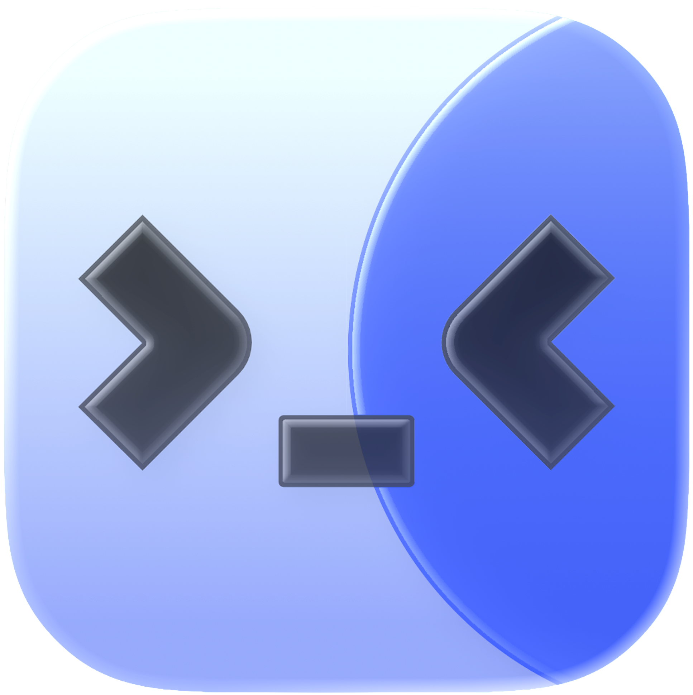
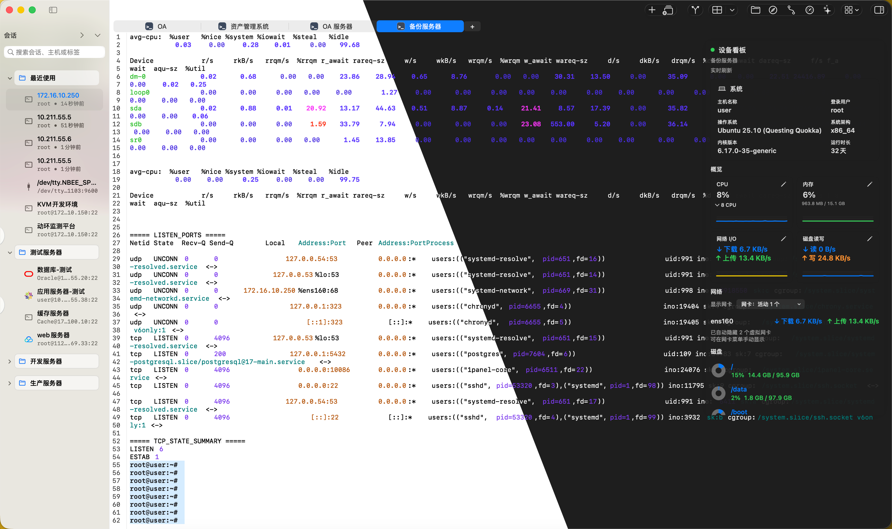
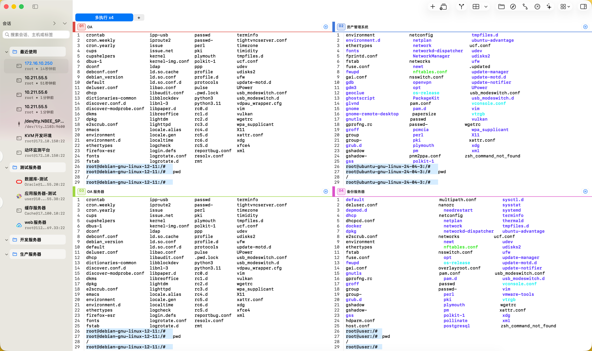
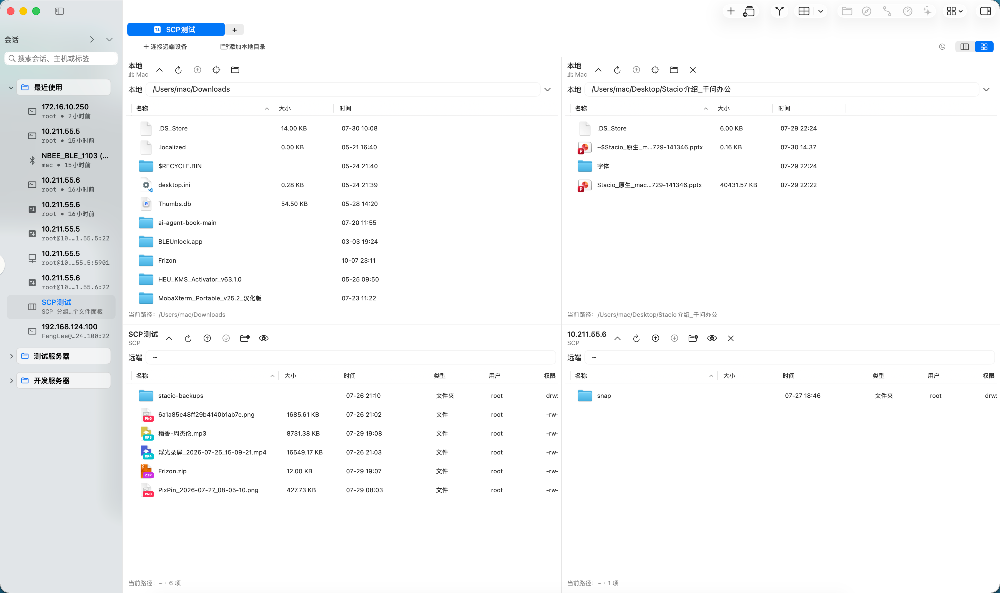
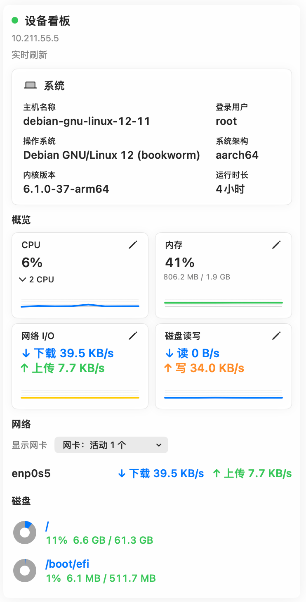
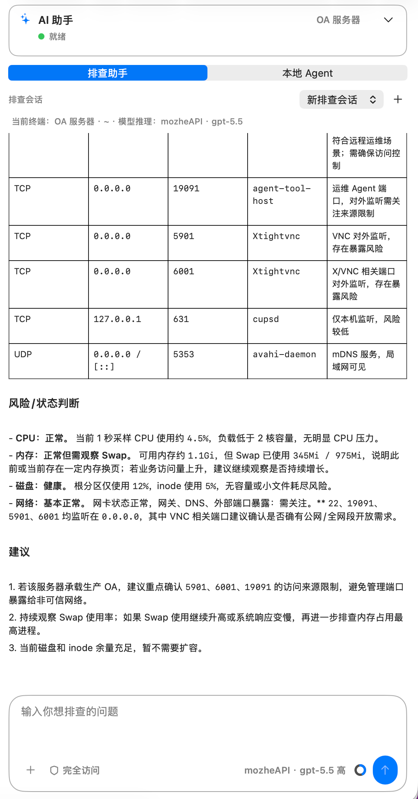
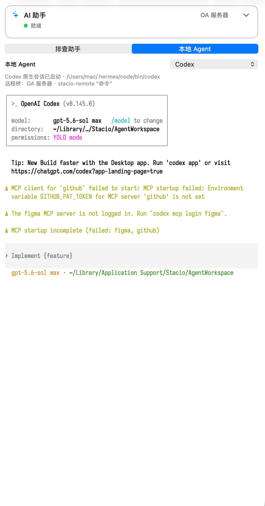
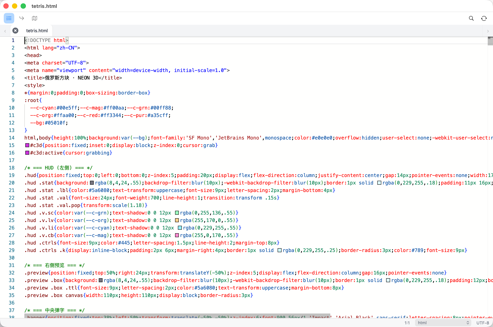
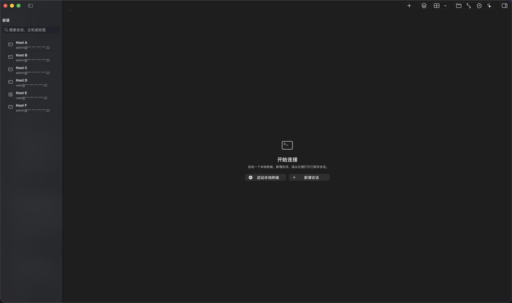

<div align="center">



# Stacio

**Native macOS SSH Client & Remote Operations Workbench**

Terminal · SCP/SFTP · Remote Files · SSH Tunnels · Device Metrics · AI Agent

[](https://www.stacio.cn/)
[](https://www.stacio.cn/)
[](LICENSE)
[](https://www.swift.org/)
[](https://www.rust-lang.org/)
[](CONTRIBUTING.md)

[Website](https://www.stacio.cn/) · [Download](https://www.stacio.cn/#download) · [GitHub](https://github.com/Fengoffer/Stacio) · [Gitee](https://gitee.com/fengoffer/Stacio) · [Release Notes](https://www.stacio.cn/#releases)

[中文](README.zh-CN.md) | **English**

</div>

---

> Stacio is a native macOS SSH client and remote operations workbench. It combines terminal sessions, SCP/SFTP file transfers, remote file editing, SSH tunnels, device monitoring, and user-confirmed AI-assisted troubleshooting into one native Mac app. **Not Electron. Not a web wrapper.** Built with Swift + AppKit, powered by a shared Rust core.

## Why Stacio

| Pain Point | Existing Tools | Stacio |
|------------|---------------|--------|
| Terminal + files + monitoring scattered across apps | iTerm2 + FileZilla + htop | One app, one window |
| Electron tools drain battery and RAM | Termius 500MB+ RAM | Native Swift, ~50MB idle |
| No Xshell for Mac | No good alternative | Session groups + split + bastion import |
| AI ops tools execute commands silently | Fear of uncontrolled AI | Commands require explicit confirmation |
| Subscription-locked SSH clients | Termius $120/yr, SecureCRT $99+ | Free core, local-first, no account required |

### How Stacio Compares

| Feature | Stacio | iTerm2 | Termius | Tabby | Electerm | SecureCRT |
|---------|--------|--------|---------|-------|----------|-----------|
| Native Mac (not Electron) | Swift + AppKit | Native | Electron | Electron | Electron | Qt |
| SSH / Telnet / Serial | SSH / Telnet / Serial / BLE | SSH only | SSH / Telnet | SSH / Telnet / Serial | SSH / Telnet / Serial | SSH / Telnet / Serial |
| SCP / SFTP file transfer | Dual-pane + multi-panel + remote-to-remote | No | Yes | Yes | Yes | No |
| Remote file editor | Syntax highlight + multi-encoding | No | No | No | Yes | No |
| File preview (spacebar) | Image / video / audio / PDF / hex | No | No | No | No | No |
| Session groups + split | Yes + sync execution | Split only | Groups only | Tabs only | Tabs only | Groups only |
| Bastion host import | TOPSEC / Xshell / SecureCRT | No | No | No | No | No |
| SSH tunnels | Local / remote / dynamic | No | Yes | No | No | No |
| Device metrics dashboard | CPU / mem / disk / network + alerts | No | Yes (paid) | No | No | No |
| AI troubleshooting | Command cards (user-confirmed) | No | No | No | No | No |
| Local agent integration | Codex / Claude / OpenCode / Qwen | No | No | No | No | No |
| SSH remote browser | Access remote web via SSH | No | No | No | No | No |
| Pricing | Free core, local-first | Free | $120/yr | Free | Free | $99+ |

## Screenshots

<p float="left">
  
  
</p>
<p float="left">
  
  
</p>
<p float="left">
  
  
</p>
<p float="left">
  
  
</p>

## Key Features

### Terminal

- **Multi-protocol**: SSH / Telnet / Serial / Bluetooth Console in one app
- **Session groups**: Organize by project, environment, or team — save and restore split layouts
- **Split views**: Horizontal / vertical splits with multi-terminal sync execution
- **Semantic highlighting**: System info, status, and errors auto-colored
- **Command completion**: Smart suggestions without phantom spaces or cursor jumps
- **Command history**: Searchable history inspector per session
- **Terminal macros**: Record and replay command sequences

### File Transfer

- **SCP/SFTP workspace**: Dual-pane and multi-panel grid layouts (2×2)
- **Drag-and-drop transfers**: Local→remote, remote→local, local→local, remote→-remote
- **Transfer queue**: Pause / resume / cancel, concurrent queue with progress, speed, and ETA
- **Integrity**: Resume broken transfers, integrity verification, automatic retry
- **Conflict handling**: Replace / keep both / skip on transfer conflicts
- **Remote file editor**: Syntax highlighting, multi-encoding, find & replace, safe save
- **File preview**: Spacebar quick look for images, video, audio, PDF, and hex

### Network & Tunnels

- **SSH tunnel management**: Local / remote / dynamic port forwarding
- **SSH remote browser**: Access remote internal web services through SSH
- **ProxyJump**: Multi-hop jump host support

### Device Monitoring

- **Real-time metrics**: CPU / memory / disk / network I/O
- **Custom alerts**: Threshold-based notifications
- **System overview**: Hostname, OS, kernel, uptime, network interfaces

### AI Agent

- **Context-aware**: Reads terminal context to generate troubleshooting suggestions
- **Command cards**: Generates executable commands — **requires user confirmation before execution**
- **Local agent integration**: Codex, Claude, OpenCode, Qwen Code
- **Safety first**: AI never executes commands, downloads, or installs silently

### Professional

- **Bastion host import**: TOPSEC / Xshell / SecureCRT config import with preview
- **Session bulk import/export**: Batch operations with deduplication
- **Session groups**: Save multi-panel layouts (terminal + file transfer) as restorable groups

## Architecture

```
┌─────────────────────────────────────┐
│         macOS UI Layer              │
│     Swift + AppKit (Native)         │
├─────────────────────────────────────┤
│         FFI Bridge                  │
│    Swift ↔ Rust Bridge              │
├─────────────────────────────────────┤
│         Rust Core (StacioCore)      │
│  · SSH Protocol (russh)             │
│  · SCP/SFTP Transfer Engine         │
│  · Session & Tunnel Management      │
├─────────────────────────────────────┤
│         Platform Layer              │
│  macOS Keychain · Network · FS      │
└─────────────────────────────────────┘
```

Each platform uses its native UI (macOS: Swift/AppKit, Windows: WinUI 3, Linux: GTK4), while the core protocol layer is unified in Rust — three platforms share the same SSH/SCP engine.

## Security

- **Credentials**: macOS Keychain, never stored in plain text
- **Local-first**: Session data stays local, not cloud-synced by default
- **Log Redaction**: Diagnostics and logs redacted by default (hostnames, IPs, accounts, paths, commands stripped)
- **AI Safety**: AI-generated commands, update downloads, installs, and restarts all require user confirmation — Stacio never executes these silently
- **Offline Licensing**: Ed25519 signatures + X25519 key agreement, cross-platform license contract (v1.2)

## Roadmap

| Platform | Status | Tech Stack |
|----------|--------|------------|
| macOS | Available now (0.14.2) | Swift + AppKit + Rust Core |
| Windows | In development | WinUI 3 / .NET 8 + Rust Core |
| Linux | Architecture baseline ready | GTK4 / libadwaita + Rust Core |
| Domestic OS | Planned | UOS · Deepin · Kylin · openEuler · HarmonyOS |

## Quick Facts

- **Current Version:** Stacio 0.14.2 Stable (Build 333)
- **System Requirements:** macOS 14 or later
- **Installer:** Separate downloads for Apple Silicon and Intel Macs
- **First Launch:** Installer is not yet notarized. If macOS blocks first launch, right-click `Stacio.app` in Finder → Open

## FAQ

<details>
<summary><b>Is Stacio a Mac SSH client?</b></summary>

Yes. Stacio is a native macOS SSH client providing remote sessions, terminal, remote files, SCP transfers, SSH tunnels, and device metrics for remote operations workflows.
</details>

<details>
<summary><b>How is Stacio different from macOS Terminal?</b></summary>

macOS Terminal is a basic system terminal. Stacio adds session persistence and grouping, split terminals, sync execution, remote files, SCP transfers, SSH tunnels, device metrics, and AI-assisted troubleshooting — for managing multiple hosts long-term.
</details>

<details>
<summary><b>Can Stacio replace Xshell on Mac?</b></summary>

Yes. If you need to manage multiple remote sessions on Mac with session groups, split terminals, sync execution, remote files, SCP transfers, and SSH tunnels, Stacio is a viable Xshell for Mac alternative. It also imports Xshell session configurations.
</details>

<details>
<summary><b>Is there a Windows or Linux version?</b></summary>

The Windows version is in development using WinUI 3 / .NET 8, sharing the same Rust core as the macOS version. The Linux version has a GTK4 / libadwaita architecture baseline. Long-term plans include native adaptation for domestic operating systems (UOS, Deepin, Kylin, openEuler, HarmonyOS).
</details>

<details>
<summary><b>How does the AI assistant work? Is it safe?</b></summary>

The AI assistant reads terminal context and generates troubleshooting suggestions as command cards. Each command card requires explicit user confirmation before execution — Stacio never runs AI-generated commands silently. You can also connect local agents (Codex, Claude, OpenCode, Qwen Code) for more advanced workflows.
</details>

<details>
<summary><b>Does Stacio manage databases?</b></summary>

No. Stacio does not provide database connection or management features.
</details>

<details>
<summary><b>How to choose Apple Silicon vs Intel installer?</b></summary>

Check your Mac's chip in "About This Mac". If it shows Apple chip, choose the Apple Silicon version. If it shows Intel, choose the Intel Mac version.
</details>

## Download & Install

Download from the [official download page](https://www.stacio.cn/#download). Separate installers are provided for Apple Silicon and Intel Macs.

## Build from Source

These dependencies and commands are for building from source only. Using the official installer does not require Xcode, Swift, Rust, or Node.js.

**Prerequisites:** Xcode Command Line Tools, Swift Package Manager, Rust toolchain + Cargo, Node.js + npm.

```bash
# Install JavaScript dependencies
npm ci

# Build Rust Core
cargo build --manifest-path StacioCore/Cargo.toml --lib

# Run tests
swift test
cargo test --manifest-path StacioCore/Cargo.toml

# Create local .app bundle
./scripts/package-app.sh
```

The built app will be at `dist/Stacio.app`.

## Contributing & License

Reproducible bug reports, improvement suggestions, and non-commercial contributions are welcome. Please read the [contributing guide](CONTRIBUTING.md) before submitting.

Stacio uses the [Stacio Source Available Non-Commercial License](LICENSE) 1.0. This license permits personal study, research, evaluation, and non-commercial derivative development. Commercial use and redistribution of official branded binaries, installers, or derivative versions require prior written authorization.

## Links

- **Website:** [https://www.stacio.cn/](https://www.stacio.cn/)
- **Download:** [https://www.stacio.cn/#download](https://www.stacio.cn/#download)
- **GitHub:** [https://github.com/Fengoffer/Stacio](https://github.com/Fengoffer/Stacio)
- **Gitee:** [https://gitee.com/fengoffer/Stacio](https://gitee.com/fengoffer/Stacio)
- **LLM Context:** [https://www.stacio.cn/llms.txt](https://www.stacio.cn/llms.txt)
- **Full Product Context:** [https://www.stacio.cn/llms-full.txt](https://www.stacio.cn/llms-full.txt)

---

<div align="center">

If Stacio helps you, please consider giving it a Star

**[GitHub](https://github.com/Fengoffer/Stacio)** · **[Gitee](https://gitee.com/fengoffer/Stacio)**

</div>
