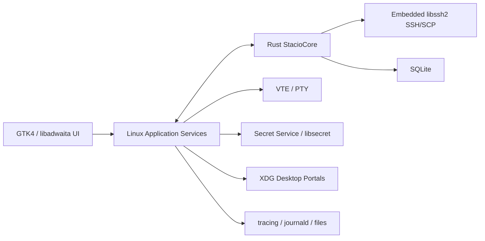

# Stacio Linux 适配架构与实施文档

版本：v1.1
日期：2026-07-23
状态：架构基线与实施计划
首要发行版：Ubuntu 24.04 LTS、Fedora 当前稳定版
目标架构：x86_64（首发）、aarch64（第二阶段）

## 1. 文档目的

本文档定义 Stacio Linux 桌面版的架构、平台边界、功能范围、打包策略、实施阶段和验收条件。Linux 版本与 Windows、macOS 共享 Rust Core 和业务契约，但使用 Linux 原生桌面外壳及系统服务。

核心原则：

1. 复用 `StacioCore`，不在 Linux UI 层重写 SSH、SCP、隧道和数据逻辑。
2. 使用 Rust + GTK4/libadwaita 构建原生 Linux 外壳，减少跨语言运行时和桥接复杂度。
3. 首发只承诺明确的发行版与桌面环境组合，不宣称“所有 Linux 均支持”。
4. Flatpak、`.deb`、`.rpm` 的权限和系统集成分别验证。
5. 不调用用户机器上的 `ssh`、`scp`、`sftp`、`rsync` 完成核心远程能力。

## 2. 范围

### 2.1 首发范围

1. 会话树、文件夹、收藏、搜索和 Quick Connect。
2. SSH 密码、私钥、agent、jump host、known hosts 和重连。
3. 本地 shell profile，支持 bash、zsh、fish 等用户 shell。
4. 远程终端标签、分屏、搜索、复制粘贴、主题和字体。
5. Files、SCP 上传下载、目录操作、冲突处理和传输队列。
6. local、remote、dynamic SOCKS5 隧道。
7. 已支持格式的会话导入。
8. MultiExec、宏、设备指标、日志和诊断包。
9. Secret Service/libsecret 凭据存储。
10. `.deb`、`.rpm` 和 Flatpak 中至少两种经过正式验证的分发方式。

### 2.2 非首发范围

1. 所有 Linux 发行版和旧版 glibc。
2. Wayland/X11 下完全一致的窗口与快捷键行为。
3. 内置完整 X Server。
4. RDP 客户端能力。
5. distro-specific 系统管理工具箱。
6. 插件市场、团队云同步和企业集中策略。

## 3. 技术决策

| 层 | 技术 | 决策 |
| --- | --- | --- |
| UI | Rust + GTK4 + libadwaita | 与 Core 同语言，符合 GNOME/现代 Linux 桌面习惯。 |
| 架构模式 | Application service + message/state model | GTK widget 不直接操作 repository 或 SSH worker。 |
| Core | 现有 Rust `StacioCore` | 共享 domain、service、repository 和内置网络引擎。 |
| Core 接入 | Rust workspace crate dependency | Linux app 优先静态链接/直接 crate 调用，避免无必要 FFI。 |
| 终端 | VTE GTK4 | 使用成熟的 libvte terminal emulator 和 PTY 集成。 |
| 本地 PTY | VTE/POSIX PTY | shell 由用户账户和 profile 决定。 |
| 数据 | SQLite，Core 单一 owner | UI 不直接修改共享业务表。 |
| 凭据 | Secret Service/libsecret | 兼容 GNOME Keyring、KWallet 的 Secret Service 实现。 |
| 日志 | Rust `tracing` + journald/file sink | 支持结构化字段、correlation id 和脱敏。 |
| 打包 | Flatpak + `.deb`，后续 `.rpm`/AppImage | 分发格式分别验收，不把一种格式的成功等同于全部成功。 |
| 更新 | Flatpak repository/distro package channel | 不在首发自建静默更新器。 |

为什么不选 Electron/Tauri 作为默认方案：现有 Core 已是 Rust，Linux 原生外壳可直接复用 crate；GTK/VTE 能提供成熟终端和桌面集成，避免 WebView terminal、JS 状态层和额外跨进程复杂度。若未来团队能力发生变化，应通过 ADR 重新评估，不能在实现中隐式换栈。

## 4. 总体架构



架构边界：

1. `StacioCore` 不引用 GTK widget 或桌面环境 API。
2. Linux application services 将 Core event 转换为 UI state。
3. terminal renderer 与 SSH transport 分离；VTE 负责渲染，不负责远程认证和 SCP。
4. portal、secret service、通知、文件选择和启动项均属于平台层。
5. Flatpak 沙箱差异不能通过 Core 中硬编码路径解决。

## 5. 推荐仓库结构

```text
Stacio/
  Cargo.toml                         # 建议升级为 workspace root
  StacioCore/                        # 现有共享 Core
  platforms/
    linux/
      Cargo.toml
      src/
        main.rs
        app/                         # lifecycle、actions、state
        views/                       # GTK widgets/windows/dialogs
        platform/                    # secret、portal、notification、paths
        terminal/                    # VTE、local PTY、remote stream adapter
        resources/                   # icons、desktop file、metainfo、i18n
      tests/
      packaging/
        flatpak/
        debian/
        rpm/
      scripts/
  contracts/                         # 跨平台 fixtures 和行为契约
```

Linux UI 与 Core 可处于同一 Cargo workspace，但依赖方向必须始终为 Linux App -> Core。Core 不得反向依赖 Linux App。

## 6. Core 复用与平台清理

### 6.1 直接复用候选

1. domain models、错误码和 service 层。
2. libssh2 SSH/SCP、shell worker 和 tunnel worker。
3. SQLite repository、migration 和审计数据。
4. import、diagnostics、redaction、device metrics parser。
5. MultiExec、macro、AI history 和 transfer state。

### 6.2 Linux 前置审计

1. 用 `x86_64-unknown-linux-gnu` 和 `aarch64-unknown-linux-gnu` 检查编译。
2. 区分 macOS `libc` 行为和 Linux `libc` 行为。
3. 检查 OpenSSL/libssh2 vendored 构建与系统库构建的许可、体积和兼容性。
4. 所有应用数据、缓存、日志遵循 XDG Base Directory Specification。
5. 本地 shell、进程、信号和 PTY 逻辑使用 Linux adapter，不假设 macOS 行为。
6. 设备指标采集不得把远端 Linux 命令解析与本机 Linux 指标混为一层。

### 6.3 共享契约

1. DTO 和数据库 migration 版本跨平台一致。
2. Core service 的成功、失败、取消和超时语义一致。
3. UI 文案可以平台化，但程序判断只依赖 error code。
4. import/export fixtures 在 macOS、Windows、Linux 运行同一组测试。
5. 平台特有 capability 通过 capability model 暴露，不用假成功占位。

## 7. Linux 平台适配

### 7.1 凭据

使用 Secret Service API/libsecret：

1. schema 使用 `application=stacio`、credential id 和 credential type。
2. Core 只持有 credential id 和短生命周期 secret。
3. 桌面没有可用 secret service 时，应用必须给出明确错误和修复说明。
4. 禁止自动降级为明文 JSON 或 SQLite。
5. Flatpak 下通过相应 portal/权限验证 keyring 访问。

### 7.2 License 授权接入

Linux 客户端必须遵循 [License 跨平台接入规范](./license-integration.md)，保持与 macOS/Windows 相同的签名 token、离线 Envelope、错误码和 entitlement：

1. 在线激活、离线 `.stacio-license` 导入和联网状态同步都通过共享 `LicenseActivationService`/`LicenseVerifier`，功能模块只读取 `LicenseAccessSnapshot`。
2. 首选 Secret Service/libsecret 保存 vault key；数据目录为 `$XDG_DATA_HOME/stacio/LicenseVault`，contractID 固定为 `stacio-license-vault-v1`。
3. Secret Service 不可用时使用权限 `0700/0600` 的加密 vault并明确报错，禁止写明文文件或 SQLite。
4. Flatpak、`.deb`、`.rpm` 的升级脚本和沙箱策略必须保留授权 vault，不能因包版本、安装路径或签名变化重新授权。
5. 设备平台字段固定为 `linux`；不同发行版和桌面环境不应改变设备摘要算法。
6. 离线协议配置缓存必须绑定 `productID=stacio` 和规范化 API 地址；开发环境缓存不得被正式 Flatpak、`.deb` 或 `.rpm` 复用。
7. 新包启动时先用包内信任锚重新验签已保存状态；临时网络失败只能保留有效快照或进入离线宽限，不得清空 LicenseVault。
8. 状态同步必须保留后台 `error.code`。`OFFLINE_LICENSE_REVOKED`/`OFFLINE_LICENSE_EXPIRED` 分别持久化为 `revoked`/`expired`；`OFFLINE_DEVICE_MISMATCH`、`OFFLINE_BINDING_NOT_FOUND`、`OFFLINE_AUTHORIZATION_SIGNATURE_INVALID` 持久化为 `invalid`，同时清空离线授权和 entitlement。
9. 网络断开、超时、429 和 5xx（含带未知错误码的 5xx）只进入离线宽限/网络不可用并保留快照；终止错误后不得因旧 activation record 自动重新激活，必须由用户明确重新导入。

Linux 首个可交付版本必须加入包后 smoke：校验公钥、Key ID、存储契约，并执行“激活 -> 重启 -> 包升级 -> 断网使用 -> 联网同步”的回归流程。公开测试向量与 Windows/macOS 共用，不能替换成发行版专属格式。

### 7.3 本地终端与 shell

1. 使用 VTE 创建本地 PTY 和终端渲染。
2. 默认 shell 从用户账户信息或 `$SHELL` 获取，但启动前验证路径。
3. 支持 login shell 与非 login shell profile。
4. resize、UTF-8、IME、组合键、信号、子进程退出和 scrollback 必须测试。
5. 远程终端仍使用 Core SSH 字节流，不调用本机 `ssh`。

### 7.4 SSH agent 与私钥

1. 支持 `SSH_AUTH_SOCK`，在 Flatpak 下明确评估 socket 暴露策略。
2. agent 不可用时不静默绕过安全策略。
3. 私钥 picker 使用 XDG Desktop Portal，兼容沙箱。
4. 文件权限检查遵循 POSIX mode，并区分只读挂载、NFS 和 portal document path。

### 7.5 XDG 路径

建议路径：

| 数据类型 | 位置 |
| --- | --- |
| 配置 | `$XDG_CONFIG_HOME/stacio` 或 `~/.config/stacio` |
| 数据库 | `$XDG_DATA_HOME/stacio` 或 `~/.local/share/stacio` |
| 缓存 | `$XDG_CACHE_HOME/stacio` 或 `~/.cache/stacio` |
| 状态/日志 | `$XDG_STATE_HOME/stacio` 或 `~/.local/state/stacio` |

所有路径由单一 platform path provider 生成。测试可注入临时目录，禁止在业务代码散落 `HOME` 拼接。

### 7.6 Wayland、X11 与桌面环境

1. Wayland 为首要测试环境，X11 为兼容环境。
2. 文件 picker、打开 URL、通知优先走 XDG Desktop Portal。
3. 全局快捷键、窗口置顶和窗口坐标恢复在 Wayland 下能力受限，应按 capability 显示。
4. GNOME 为首要 UX 基线，同时验证 KDE Plasma。
5. 不依赖 GNOME Shell extension 才能完成核心工作流。

### 7.7 文件与拖放

1. 支持本地路径、portal document URI、可移动介质和网络挂载。
2. 文件名按字节/UTF-8 边界审慎处理，展示层不得导致不可逆重命名。
3. Files 大目录使用增量加载和 GTK list virtualization。
4. Flatpak 下上传与下载目录权限必须通过 portal 或显式 filesystem permission 获得。

### 7.8 通知与后台行为

1. 使用 `org.freedesktop.Notifications` 或 portal notification。
2. 默认关闭窗口即退出，除非明确提供后台/托盘模式。
3. 若提供托盘，必须兼容没有 StatusNotifier 支持的桌面环境。
4. 应用退出时提示仍运行的 tunnel 和 transfer，不能遗留不可管理进程。

## 8. UI 功能映射

| 产品概念 | Linux 实现 |
| --- | --- |
| 主工作台 | `AdwApplicationWindow` |
| 会话树 | GTK ListView/TreeListModel |
| 标签 | AdwTabView |
| 三栏布局 | AdwOverlaySplitView/GTK Paned 组合 |
| 终端 | VTE GTK4 |
| 设置 | AdwPreferencesWindow |
| 确认与错误 | AdwAlertDialog/Toast |
| 凭据 | Secret Service/libsecret |
| 文件选择 | XDG Desktop Portal |
| 通知 | freedesktop/portal notification |

Linux 版本保持 Stacio 的信息架构、功能命名和风险提示，但使用 libadwaita 控件语义。不要逐像素复制 macOS sidebar、toolbar 和 sheet。

## 9. 分发策略

### 9.1 Flatpak

优点是跨发行版和依赖可控；主要风险是 SSH agent、文件系统和 secret service 的沙箱权限。

必须验证：

1. 文件 picker 与上传下载。
2. Secret Service。
3. `SSH_AUTH_SOCK` 策略。
4. 网络权限和 loopback tunnel。
5. 通知、打开 URL 和诊断包导出。
6. Flathub manifest 的依赖来源、许可和构建可复现性。

### 9.2 `.deb`

首要目标 Ubuntu 24.04 LTS。必须声明最低 GTK/libadwaita/glibc 版本，安装后提供 desktop file、icon、AppStream metadata 和卸载行为。

### 9.3 `.rpm`

首要目标 Fedora 当前稳定版。不能直接将 `.deb` 文件布局改名；需要独立 spec、依赖和安装测试。

### 9.4 AppImage

仅作为可选便携分发。若 GTK、VTE、portal 或 keyring 集成不稳定，不应作为首发主渠道。

## 10. 实施阶段

### L0：Core Linux 可构建性

交付物：

1. Core 在 `x86_64-unknown-linux-gnu` 构建并通过测试。
2. 修复 macOS/POSIX 混淆和路径假设。
3. 建立 Linux CI 和本地 SSH fixture。
4. 定义 XDG path provider 和 platform capability model。

完成定义：干净 Ubuntu CI 能构建并运行 Core 测试，不依赖 macOS 生成物。

### L1：GTK 外壳与数据

交付物：

1. GTK4/libadwaita 工程、主窗口和基础导航。
2. session CRUD、搜索和持久化。
3. Secret Service adapter。
4. tracing、日志目录和诊断入口。

完成定义：重启后会话保持，secret 不进入数据库；无 keyring 时显示可操作错误。

### L2：本地与远程终端

交付物：

1. VTE 本地 shell。
2. Core live SSH shell 接入。
3. 标签、分屏、搜索、复制粘贴和 resize。
4. Wayland/X11 输入与 IME 测试。

完成定义：本地 shell 和真实 SSH 连续运行 60 分钟；高输出时 UI 可交互，退出无残留 worker。

### L3：Files、传输和隧道

交付物：

1. Files 与当前 live session 绑定。
2. 目录操作、上传下载、取消和冲突处理。
3. local/remote/dynamic tunnel。
4. portal 文件权限和沙箱行为。

完成定义：原生包和 Flatpak 候选环境均不调用系统 SSH 工具完成核心验收。

### L4：高级工作流

交付物：

1. 导入、MultiExec、宏、设备指标和 AI 面板。
2. 通知、快捷键、可访问性和诊断包。
3. GNOME/KDE 与 Wayland/X11 兼容性修复。

完成定义：跨平台 fixtures 一致，关键流程可用键盘完成，并通过 Orca 基础测试。

### L5：打包与发布准备

交付物：

1. Flatpak manifest 和安装 smoke。
2. Ubuntu `.deb` 和 Fedora `.rpm` 至少完成已承诺渠道。
3. x86_64 artifact；aarch64 若进入本期则独立构建验证。
4. SBOM、许可、更新/回滚和已知限制。

完成定义：每一种对外宣称支持的包格式均完成全新安装、升级、卸载和核心功能 smoke。

## 11. 测试矩阵

| 维度 | 最低覆盖 |
| --- | --- |
| 发行版 | Ubuntu 24.04 LTS、Fedora 当前稳定版 |
| 桌面 | GNOME、KDE Plasma |
| 显示协议 | Wayland、X11 |
| CPU | x86_64；发布前增加 aarch64 |
| 包格式 | Flatpak、`.deb`；如承诺则增加 `.rpm` |
| Shell | bash、zsh、fish |
| 凭据 | GNOME Keyring、KWallet/Secret Service、无 keyring 错误路径 |
| SSH | 密码、私钥、passphrase、agent、jump host |
| 文件 | 本地目录、portal 文件、网络挂载、中文和 emoji 文件名 |

测试层次：

1. Rust Core 单元与集成测试。
2. Linux platform adapter 测试。
3. GTK state/application service 测试。
4. headless 可运行部分使用 `xvfb`；Wayland 行为使用真实 compositor 测试环境。
5. 安装后的 binary、desktop entry、icon、MIME/protocol 和卸载 smoke。

## 12. 性能与质量门槛

1. 冷启动进入主窗口目标小于 2 秒。
2. 空闲内存目标小于 180 MB。
3. 10 个 SSH 会话空闲 CPU 接近 0。
4. terminal 高频输出不阻塞 GTK main loop。
5. Files 大目录不一次性创建全部 widget。
6. SQLite 写入保持单 owner/串行策略。
7. 后台任务可取消，退出应用后无孤立 tunnel、PTY 或 SSH worker。

## 13. CI/CD

建议流水线：

1. `cargo fmt --check`、`cargo clippy`、`cargo test`。
2. GTK/Linux app build 与测试。
3. Ubuntu、Fedora container/runner 的依赖兼容测试。
4. Flatpak builder 构建和沙箱 smoke。
5. `.deb`/`.rpm` lint、安装、升级和卸载测试。
6. x86_64 与 aarch64 分架构构建及组件检查。
7. SBOM、license report、hash 和签名。

发布仓库、Flathub、apt/rpm repository 的提交或上传必须人工确认。PR 流水线只生成候选 artifact。

## 14. 安全要求

1. host key 首次确认和变化阻断规则跨平台一致。
2. secret service 不可用时禁止明文降级。
3. Flatpak 权限遵循最小化原则，不申请整个 home 的永久读写作为默认方案。
4. 日志和诊断包执行统一脱敏。
5. AI 命令、MultiExec 和生产环境操作保留确认和审计。
6. 不从不可信路径加载共享库、terminal plugin 或更新脚本。
7. 发行包提供依赖清单、SBOM 和第三方许可。

## 15. 主要风险

| 风险 | 应对 |
| --- | --- |
| Linux 发行版碎片化 | 明确支持矩阵，只对通过测试的发行版和包格式作承诺。 |
| Flatpak 限制 agent/文件访问 | 早期完成 portal、Secret Service 和 agent PoC。 |
| GTK/VTE 版本差异 | 以 Ubuntu LTS 最低版本确定 API 基线。 |
| Wayland 限制窗口与快捷键 | 使用 capability model，不伪造不可用功能。 |
| libssh2/OpenSSL 分发复杂 | 固定构建策略，生成 SBOM 并做干净环境测试。 |
| Core 含 macOS 假设 | L0 阶段以 Linux CI 和 contract tests 强制清理。 |
| UI 与 Core 同为 Rust导致边界模糊 | 通过 crate/module 依赖规则和 application service 保持分层。 |

## 16. 禁止事项

1. 禁止复制 Core 逻辑到 GTK UI crate。
2. 禁止声称支持未进入测试矩阵的发行版。
3. 禁止用系统 ssh/scp 命令替代内置引擎。
4. 禁止无 keyring 时保存明文 secret。
5. 禁止为 Flatpak 方便而默认开放整个主目录。
6. 禁止只验证可执行文件启动就宣称某种包格式发布完成。

## 17. 最终验收

Linux 版本只有同时满足以下条件才视为完成：

1. 核心用户旅程在 GTK 原生 UI 中完整可用。
2. Core contract 与数据库 migration 测试在 Linux 通过。
3. SSH/SCP/隧道不依赖系统命令。
4. Secret Service、XDG 路径、VTE、portal、Wayland 和 X11 完成平台验证。
5. 每个承诺支持的发行版、桌面环境和包格式都有独立测试证据。
6. x86_64 包完成安装、升级、卸载和 smoke；aarch64 若进入发布范围则同等级验证。
7. 已输出已知限制、许可、SBOM、诊断和回滚说明。
