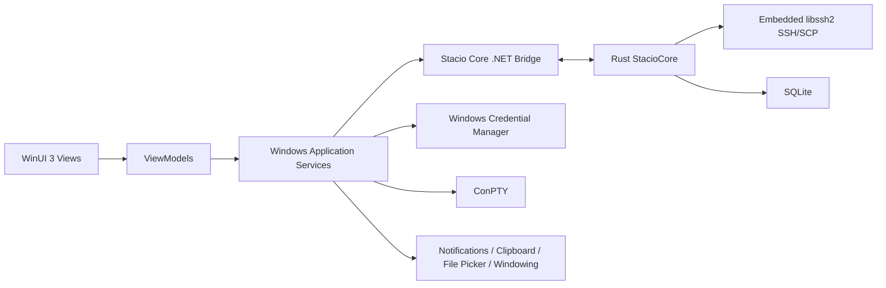

# Stacio Windows 适配架构与实施文档

版本：v1.1
日期：2026-07-23
状态：可交接实施
目标平台：Windows 11、Windows Server 2022 及更新版本
目标架构：x86_64（首发）、ARM64（第二阶段）

## 1. 文档目的

本文档用于将 Stacio Windows 客户端交接给独立开发人员或团队。接手方应能够依据本文完成工程初始化、Rust Core 接入、Windows 原生 UI、系统能力适配、测试、安装包和发布流水线，不需要重新决定总体架构。

Windows 版本不是 macOS AppKit 工程的移植构建，也不是重新实现一套业务核心。总体原则是：

1. 复用并持续收敛 `StacioCore` Rust 业务核心。
2. Windows 使用 C#、.NET 8 和 WinUI 3 构建原生外壳。
3. Windows 专属能力通过平台适配接口接入，不进入通用业务模型。
4. Windows 与 macOS 共享数据契约、数据库迁移、错误码和核心行为测试。
5. 不调用用户机器上的 `ssh.exe`、`scp.exe`、`sftp.exe` 或 WSL 完成产品核心能力。

## 2. 范围

### 2.1 首发范围

1. 会话树、文件夹、收藏、搜索和 Quick Connect。
2. SSH 密码、私钥、SSH agent、jump host、known hosts 和重连。
3. 本地 PowerShell、Command Prompt 和可选 WSL profile。
4. 远程终端标签、分屏、搜索、复制粘贴、主题和字体。
5. SSH 后自动打开 Files，支持目录浏览、上传、下载、删除、重命名和冲突处理。
6. local、remote、dynamic SOCKS5 隧道。
7. CSV、MobaXterm、Xshell、SecureCRT 等现有支持格式的会话导入。
8. MultiExec、宏、传输队列、设备指标、日志和诊断包。
9. Windows Credential Manager 凭据存储。
10. MSIX 安装、升级和卸载。

### 2.2 非首发范围

1. Windows 7、Windows 8、32 位 x86。
2. 将 WSL 作为 SSH/SCP 核心实现。
3. RDP 客户端能力。
4. 完整 X Server。
5. 与 macOS 完全一致的像素级界面。
6. 插件市场、团队云同步和企业策略中心。

## 3. 技术决策

| 层 | 技术 | 决策 |
| --- | --- | --- |
| UI | C# + .NET 8 + WinUI 3 | 使用 Windows App SDK，提供原生窗口、菜单、可访问性和 DPI 支持。 |
| 架构模式 | MVVM | View 不直接调用 FFI；ViewModel 调用 Application Services。 |
| Core | Rust `StacioCore` | 复用 SSH、SCP、隧道、数据模型、导入、安全和诊断逻辑。 |
| Bridge | UniFFI C# bindings 或窄 C ABI | 先验证 UniFFI C# 生成链；不满足时使用稳定 C ABI 包装，不在 UI 层直接 P/Invoke 大量函数。 |
| 终端 | Windows Terminal Control 优先评估 | 若官方控件不可稳定再分发，选择成熟的 WinUI/WPF terminal control；禁止自研 VT parser 起步。 |
| 本地 PTY | ConPTY | PowerShell、cmd 和 WSL 均通过 ConPTY 承载。 |
| 数据 | SQLite，Rust Core 单一 owner | Windows UI 不直接修改共享业务表。 |
| 凭据 | Windows Credential Manager | Core 仅持有 credential id 和短生命周期 secret。 |
| 日志 | `Microsoft.Extensions.Logging` + Rust 日志 | 统一 correlation id，默认脱敏。 |
| 安装 | MSIX | 首选签名 MSIX；企业离线场景可补充 winget 和独立安装器。 |
| 更新 | App Installer/MSIX 更新源 | 不复用 Sparkle；发布策略与 macOS 独立。 |

## 4. 总体架构



关键边界：

1. Rust Core 不引用 WinUI、WinRT 或注册表 API。
2. ViewModel 不直接持有原生 Rust 指针或跨 FFI callback。
3. 高频终端字节流与低频控制 API 分开设计。
4. 数据库 schema 由 Core 维护，所有平台使用相同 migration 序列。
5. 凭据内容不写入 SQLite、日志、崩溃报告或 ViewModel 可序列化状态。

## 5. 推荐仓库结构

```text
Stacio/
  StacioCore/                       # 现有共享 Rust Core
  platforms/
    windows/
      Stacio.Windows.sln
      src/
        Stacio.Windows.App/         # WinUI 3 app、窗口和资源
        Stacio.Windows.Application/ # use cases、ViewModels、协调器
        Stacio.Windows.Platform/    # Credential、ConPTY、通知、更新
        Stacio.Windows.CoreBridge/  # Rust FFI 封装和 DTO 映射
      tests/
        Stacio.Windows.UnitTests/
        Stacio.Windows.IntegrationTests/
        Stacio.Windows.UITests/
      packaging/
        msix/
      scripts/
  contracts/                        # 可选：跨平台 fixtures 和契约说明
```

Windows 开发不得修改 macOS UI 目录来容纳 Windows 条件编译。共享逻辑应下沉到 `StacioCore` 或明确的跨平台 contract；Windows 专属实现留在 `platforms/windows`。

## 6. Core 复用与改造

### 6.1 直接复用候选

1. Session、SSH、SCP、Files、Tunnel、Transfer 等 domain model。
2. libssh2 transport、shell worker、SCP engine 和 SOCKS5 tunnel。
3. 会话、known hosts、传输、审计、宏和 AI 历史 repository。
4. 导入解析、设备指标解析、诊断脱敏和错误分类。
5. MultiExec、宏、SSH/SCP/tunnel service。

### 6.2 必须先清理的平台耦合

1. 搜索 Rust 中的 macOS 路径、shell、环境变量和进程假设。
2. 本地 shell 模型不得默认 `/bin/zsh`；改为由平台层传入 shell profile。
3. 文件路径跨 FFI 使用明确的 UTF-8/UTF-16 转换策略，禁止用字符串拼接模拟路径 API。
4. 动态库加载、数据库目录和诊断目录由平台层注入。
5. Core 错误必须输出稳定 error code，不以 macOS 本地化文本作为程序判断条件。

### 6.3 Bridge 规则

1. 只暴露版本化 DTO、枚举、命令和事件。
2. 所有长任务返回 operation/runtime id，支持取消和状态查询。
3. callback 进入 .NET 后立即转入受控队列，再调度到 UI thread。
4. terminal output 使用批量字节块，禁止逐字符跨 FFI。
5. Bridge 必须处理 Core panic，不能让异常穿透并终止 UI 进程。
6. 每个公开 API 至少有一项 .NET 到 Rust 的集成测试。

## 7. Windows 平台适配

### 7.1 凭据

使用 Windows Credential Manager 保存密码、私钥 passphrase 和 AI API key：

1. target name 使用稳定命名，例如 `Stacio/SSH/{credential-id}`。
2. SQLite 只保存 credential id、类型和显示信息。
3. 解密后的 secret 使用后立即释放，不写诊断日志。
4. 删除会话时由业务规则决定是否删除共享 credential，不允许静默误删。
5. 企业环境中验证 Windows Hello/DPAPI 策略下的行为。

### 7.2 License 授权接入

Windows 客户端必须遵循 [License 跨平台接入规范](./license-integration.md)，不得为 Windows 单独发明 token 或 entitlement 格式。平台适配只负责安全存储和设备摘要：

1. 在线激活、离线 `.stacio-license` 导入和联网状态同步都调用共享 `LicenseActivationService`/`LicenseVerifier`。
2. vault key 使用 Windows Credential Manager/DPAPI 保护，逻辑路径为 `%LOCALAPPDATA%\\Stacio\\LicenseVault`，contractID 固定为 `stacio-license-vault-v1`。
3. MSIX 覆盖升级、App Installer 更新、独立安装包升级和重启不得删除 LicenseVault；卸载重装测试必须明确数据保留策略。
4. 设备平台字段固定为 `windows`。硬件指纹摘要变化只能产生设备不匹配错误，不能静默新建第二份授权。
5. UI 层只订阅 `LicenseAccessSnapshot`，不能在每个专业版功能入口里调用网络校验。
6. 离线协议配置缓存必须绑定 `productID=stacio` 和规范化 API 地址；开发环境缓存不得被正式 MSIX 或 OTA 包读取。
7. 新包启动时先用包内信任锚重新验签已保存状态；临时网络失败只能保留有效快照或进入离线宽限，不得清空 LicenseVault。
8. 状态同步必须保留后台 `error.code`。`OFFLINE_LICENSE_REVOKED`/`OFFLINE_LICENSE_EXPIRED` 分别持久化为 `revoked`/`expired`；`OFFLINE_DEVICE_MISMATCH`、`OFFLINE_BINDING_NOT_FOUND`、`OFFLINE_AUTHORIZATION_SIGNATURE_INVALID` 持久化为 `invalid`，同时清空离线授权和 entitlement。
9. 网络断开、超时、429 和 5xx（含带未知错误码的 5xx）只进入离线宽限/网络不可用并保留快照；终止错误后不得因旧 activation record 自动重新激活，必须由用户明确重新导入。

Windows 必须在首个可交付版本加入包后 smoke：校验在线/离线公钥、Key ID、兑换地址、存储 contractID，并执行“激活 -> 重启 -> MSIX 升级 -> 断网使用 -> 联网同步”的回归流程。

### 7.3 本地终端

1. 使用 ConPTY 创建伪终端。
2. 默认 profile 为 PowerShell；检测 `pwsh.exe` 后可优先展示 PowerShell 7。
3. Command Prompt 和 WSL 为可选 profile。
4. WSL 仅是本地终端 profile，不承载 Stacio 内置 SSH/SCP。
5. resize、UTF-8、Ctrl+C、Ctrl+Break、Alt、粘贴和进程退出必须分别测试。

### 7.4 SSH agent 与私钥

1. 支持 OpenSSH agent/Windows OpenSSH 的可用能力。
2. agent 不可用时明确回退到私钥或密码认证，不静默改变认证方式。
3. 支持 Windows 路径、UNC 路径和带空格私钥路径。
4. 私钥文件权限检查应符合 Windows ACL 语义，不能照搬 POSIX mode。

### 7.5 窗口与交互

1. 使用 WinUI NavigationView/TreeView、TabView、GridSplitter 等原生控件。
2. 支持多窗口、窗口状态恢复、per-monitor DPI 和 100% 至 300% 缩放。
3. 标题栏、系统菜单、快捷键和右键菜单遵循 Windows 11 习惯。
4. 支持键盘完整操作、Narrator 和高对比度模式。
5. 不照搬 macOS toolbar、traffic lights、sheet 或菜单位置。

### 7.6 文件与拖放

1. 文件选择使用 Windows Storage Picker 或与桌面权限兼容的 picker。
2. 支持盘符、UNC、长路径、OneDrive 占位文件和只读位置。
3. 拖放上传必须处理虚拟文件与延迟提供的数据。
4. 下载冲突策略与 Core 保持一致，展示使用 Windows 原生对话框。

### 7.7 通知、托盘与单实例

1. 长任务完成和断连通知使用 Windows App SDK notifications。
2. 是否提供系统托盘由产品需求决定；若提供，关闭窗口与退出应用必须区分。
3. 使用 AppInstance 处理单实例和协议唤起。
4. 通知正文不得包含密码、完整命令输出或敏感主机信息。

## 8. UI 功能映射

| macOS 当前概念 | Windows 实现 |
| --- | --- |
| `NSWindow`/Workbench | WinUI `Window` + 自定义主布局 |
| `NSSplitViewController` | Grid + GridSplitter |
| `NSOutlineView` 会话树 | TreeView |
| `NSTabView`/工作区标签 | TabView |
| SwiftTerm | 选定的 Windows terminal control |
| Keychain | Credential Manager |
| Sparkle | MSIX/App Installer 更新 |
| `NSOpenPanel`/`NSSavePanel` | Windows file/folder picker |
| `NSAlert`/sheet | ContentDialog/TeachingTip/独立确认窗口 |
| macOS notifications | Windows App Notifications |

界面目标是工作流一致而不是像素一致。信息架构、功能名称、数据和风险提示应跨平台一致；控件行为、布局密度和系统入口应遵循 Windows 规范。

## 9. 实施阶段

### W0：可构建性审计与契约冻结

交付物：

1. `cargo test` 在 `x86_64-pc-windows-msvc` 通过。
2. 列出并修复 Core 中的 macOS/POSIX 假设。
3. 定义 Bridge API v1、事件模型和错误码表。
4. 生成最小 C# binding，完成 health/version 调用。
5. 建立 Windows CI runner。

完成定义：干净 Windows 机器可构建 Core，并由 .NET 测试进程成功加载和调用。

### W1：原生外壳与数据

交付物：

1. 主窗口、会话树、标签区、Inspector 和设置入口。
2. SQLite migration 和 session CRUD。
3. Credential Manager adapter。
4. 日志、崩溃边界和诊断目录。

完成定义：创建、编辑、删除、搜索会话后重启应用数据保持，secret 不进入数据库。

### W2：本地与远程终端

交付物：

1. ConPTY local terminal。
2. Rust live SSH shell 接入。
3. terminal input/output、resize、close、reconnect。
4. 标签、分屏、搜索和复制粘贴。

完成定义：本地 PowerShell 和真实 SSH 均可连续运行 60 分钟；高输出时 UI 可交互，关闭后无残留 worker。

### W3：Files、传输和隧道

交付物：

1. SSH 后 Files 自动绑定当前 live session。
2. 目录操作、上传、下载、进度、取消和冲突处理。
3. local/remote/dynamic tunnel。
4. 隧道与传输日志。

完成定义：不调用系统 SSH 工具即可完成核心文件和隧道验收，传输不阻塞终端输入。

### W4：高级工作流

交付物：

1. 会话导入。
2. MultiExec 和宏。
3. 设备指标、AI 面板和诊断包。
4. Windows 通知、快捷键和可访问性。

完成定义：功能行为与跨平台 contract fixtures 一致，Windows 专属交互通过 UI 自动化测试。

### W5：发布准备

交付物：

1. x86_64 MSIX、签名和安装升级测试。
2. ARM64 构建和组件架构验证。
3. winget manifest 草案。
4. SBOM、第三方许可、隐私说明和回滚方案。

完成定义：全新安装、覆盖升级、卸载重装和离线启动全部通过；x86_64 与 ARM64 包分别验证。

## 10. 测试策略

### 10.1 Core

1. Windows 上运行全部 Rust 单元测试和集成测试。
2. SSH/SCP 使用本地 fixture server，不依赖公网。
3. SQLite migration 必须验证从当前 macOS schema 版本升级。
4. 使用共享 JSON fixtures 验证导入、错误码和 DTO 序列化。

### 10.2 .NET

1. ViewModel 和 Application Services 单元测试。
2. Bridge 生命周期、异常和 callback 集成测试。
3. Credential、ConPTY、路径和通知 adapter 测试。
4. WinAppDriver/Playwright Windows 或等效工具执行关键 UI 流程。

### 10.3 必测矩阵

| 维度 | 最低覆盖 |
| --- | --- |
| OS | Windows 11 当前版、Windows Server 2022 |
| CPU | x86_64；发布前增加 ARM64 |
| DPI | 100%、150%、200%、300% |
| Shell | Windows PowerShell、PowerShell 7、cmd、WSL |
| 网络 | 直连、jump host、断网重连、高延迟 |
| 凭据 | 密码、私钥、passphrase、agent |
| 文件 | 本地盘、UNC、长路径、中文和 emoji 文件名 |

## 11. 性能与质量门槛

1. 冷启动进入主窗口目标小于 2 秒。
2. 空闲内存目标小于 220 MB。
3. 10 个 SSH 会话空闲 CPU 接近 0。
4. terminal 高频输出时 UI 输入和窗口拖动无明显冻结。
5. 单次 callback 不逐字符跨 FFI。
6. Files 大目录采用分页、虚拟化或增量加载。
7. 所有后台任务可取消，窗口关闭后不得继续访问已释放 UI 对象。

## 12. CI/CD 与发布

建议流水线：

1. `cargo fmt --check`、`cargo clippy`、`cargo test`。
2. `dotnet restore`、`dotnet build`、`dotnet test`。
3. Bridge 生成物一致性检查。
4. x86_64 MSIX 构建和安装 smoke。
5. ARM64 独立构建，不用修改二进制标记伪造架构。
6. 签名、恶意软件扫描、SBOM 和 artifact hash。
7. 人工确认后发布更新源和 winget。

证书、更新 feed token 和发布凭据只放 CI secret store。PR 构建不得拥有正式发布权限。

## 13. 安全要求

1. SSH host key 首次连接必须确认，变化时阻断连接。
2. secret 只通过 credential provider 短时进入 Core。
3. 日志统一执行字段级脱敏。
4. 导入不能尝试破解第三方加密密码。
5. AI 命令执行、MultiExec 和生产环境操作沿用现有确认与审计边界。
6. MSIX 必须签名；正式发布前验证 SmartScreen 和企业策略环境。
7. 禁止下载并执行未校验的 helper、terminal runtime 或更新包。

## 14. 交接清单

接手人开始编码前应确认：

1. 已阅读本文、PRD、安全威胁模型和 Rust Core 模块结构。
2. 已获得 Windows 11 x86_64 开发机和 ARM64 验证环境。
3. 已完成 terminal control 的许可、维护状态和分发可行性评估。
4. 已确认 Bridge 采用 UniFFI C# 还是窄 C ABI，并提交 ADR。
5. 已建立 Windows CI，禁止只在个人机器构建。
6. 已将 W0-W5 建成可跟踪里程碑，每项包含测试和完成定义。
7. 已明确签名证书、更新源和发布动作的负责人；开发人员默认无权公开发布。

## 15. 禁止事项

1. 禁止复制一份 Rust 业务逻辑到 C#。
2. 禁止为 Windows 修改 macOS UI 行为或引入大量条件编译。
3. 禁止以 WSL/系统 ssh 命令替代内置引擎。
4. 禁止 UI 直接读写共享 SQLite 业务表。
5. 禁止把密码、API key 或私钥 passphrase 写入配置文件。
6. 禁止在没有安装、升级和卸载验证时宣称 Windows 版本可发布。

## 16. 最终验收

Windows 版本只有同时满足以下条件才视为完成：

1. 核心用户旅程在 Windows 原生 UI 中完整可用。
2. SSH/SCP/隧道不依赖外部系统命令。
3. 与 macOS 共享的 Core contract 测试全部通过。
4. Credential Manager、ConPTY、路径、DPI 和可访问性通过平台测试。
5. x86_64 安装包完成签名、安装、升级、卸载和 smoke test。
6. ARM64 若列入当前发布范围，必须独立构建并完成同等级验证。
7. 已输出已知限制、第三方许可、SBOM、回滚与诊断说明。
