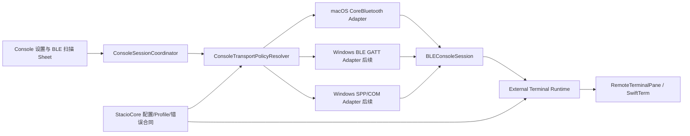
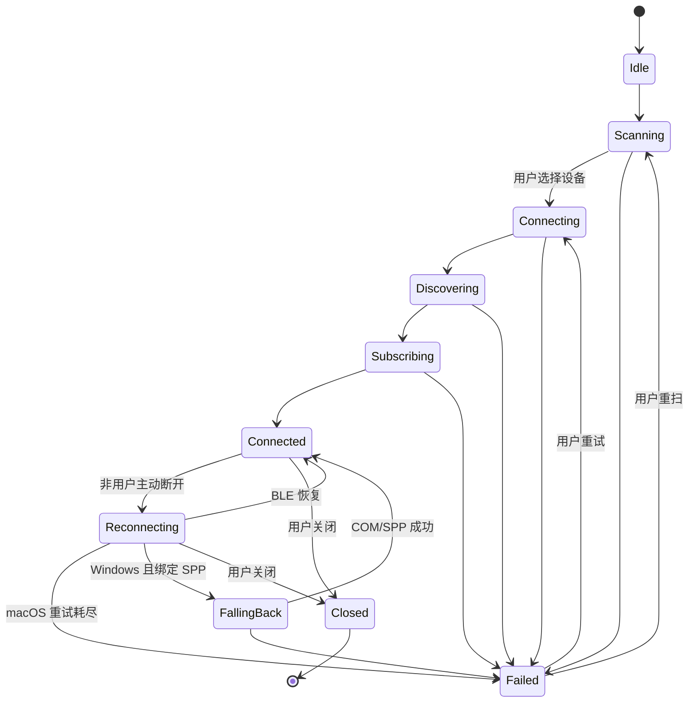

# Stacio BLE Console 跨平台架构设计

日期：2026-07-29
状态：已批准（用户于 2026-07-29 确认）
目标平台：macOS 14 及以上；Windows 11 / Windows Server 2022 及以上（后续实现）
设计基线：BLE GATT 优先；macOS 不做 SPP 自动兜底；Windows 仅对明确绑定的 COM/SPP 端点做受控自动兜底

## 1. 文档目的

本文冻结 Stacio Bluetooth Console 的产品行为、跨平台合同、macOS 原生实现边界、未来 Windows 适配边界、UI 规范、错误模型和验收标准。开发人员或 AI 接手后应能据此编写实施计划和代码，不需要重新决定 BLE 与 SPP 的优先级、BTerm-compatible profile、终端接入方式或平台兜底策略。

本文描述目标设计，不代表代码已经实现。现有系统串口、USB 串口和 macOS SPP 代码在本设计阶段保持原样。

## 2. 已确认事实

### 2.1 BTerm 实现证据

BTerm Web 的公开产物确认使用 Web Bluetooth 和 BLE GATT，不是经典蓝牙 SPP：

1. 通过 `navigator.bluetooth.requestDevice()` 请求设备。
2. 通过 GATT service/characteristic discovery 获取 UART 通道。
3. 通过 `startNotifications()` 接收 Console 字节。
4. 通过 `writeValueWithoutResponse()` 发送 Console 字节。
5. Web 应用说明为 “console serial ports over BLE”。

公开入口：

- <https://bterm.app/>
- <https://bterm.app/web/>
- <https://bterm-files.weiyunjian.com/web/main.dart.js>

未找到 BTerm 的公开源码仓库，因此上述判断来自公开下发的 Web bundle、页面元数据和实际设备行为，不应表述为源码级审计。

### 2.2 NBEE 1103 真机证据

用户已在 macOS Chrome 的 BTerm Web 中完成以下验证：

1. Web Bluetooth 设备选择器可以发现 `NBEE_BLE_1103`。
2. 设备行显示信号强度状态。
3. 设备提供 Service `FFE1`。
4. TX Characteristic 为 `FFE3`，具备 `write` 和 `write without response` 属性。
5. RX Characteristic 为 `FFE2`。
6. 选择该 profile 后，BTerm 可以正常调试交换机和路由器 Console。

这证明 NBEE 1103 属于本文定义的 `bterm-ffe1-split-v1` profile。macOS 原生 CoreBluetooth 仍需通过 Stacio 真机验收，但设备 BLE 能力和 GATT 合同不再是未知项。

### 2.3 当前 Stacio 边界

当前 Stacio Serial 路径为：

```text
设备 -> macOS SPP/USB 串口驱动 -> /dev/cu.* -> Rust serialport/termios -> Terminal Runtime
```

NBEE SPP 曾出现“设备节点可独占打开，但 Stacio、NyaTerm 和 screen 均收不到字节”的现象。该现象证明串口路径选择成功，不证明 macOS SPP 链路可用。

目标 BLE 路径为：

```text
设备 BLE 广播 -> CoreBluetooth -> GATT UART -> Terminal Runtime -> SwiftTerm
```

BLE 是独立 transport，不是对 `/dev/cu.*` 或 Rust `serialport` 的修补。

## 3. 术语

| 术语 | 本文含义 |
| --- | --- |
| BLE | Bluetooth Low Energy；通过 GATT service/characteristic 传输字节。 |
| SPP | Bluetooth Classic Serial Port Profile；通常由系统映射为 macOS 设备节点或 Windows COM 口。 |
| BLE Console | 通过 BLE GATT UART profile 承载设备 Console 字节流。 |
| System Serial | USB 串口、物理串口或系统暴露的 SPP 串口。 |
| Profile | Service UUID、TX UUID、RX UUID 和写入类型的稳定组合。 |
| TX | Stacio 向设备写入的 characteristic。 |
| RX | Stacio 订阅通知或指示、从设备接收数据的 characteristic。 |
| 受控兜底 | 只连接保存会话中明确绑定的 SPP/COM 端点，不按名称猜测或随机选择。 |

产品文案必须使用“BLE 直连”和“系统串口（SPP/USB）”区分两类 transport，不能只写含义模糊的“蓝牙”。

## 4. 目标与非目标

### 4.1 目标

1. macOS 原生扫描 BLE 设备，显示设备名称、信号图标和 RSSI dBm。
2. `NBEE_BLE_1103` 被识别后高亮并置顶，但不未经用户选择自动连接。
3. 自动识别两套 BTerm-compatible BLE UART profile。
4. 未命中内置 profile 时允许用户手动选择有效 TX/RX characteristic，并保存结果。
5. BLE 字节流复用现有 SwiftTerm、Terminal Runtime、宏、多执行、日志、AI/Agent 输入和输出保护能力。
6. macOS BLE Console 失败时只提供 BLE 诊断、重扫和重试，不自动尝试 SPP。
7. Windows 后续实现 BLE 优先，并只对保存会话中明确绑定的 COM/SPP 端点自动兜底。
8. 保留现有 `serial` 会话和系统串口能力，不迁移、不破坏旧会话。
9. 形成稳定跨平台配置、profile、状态和错误码合同。

### 4.2 非目标

1. 不修复 macOS 系统 SPP 驱动。
2. 不将 BTerm Web 或外部 Chrome 嵌入 Stacio。
3. 不在首版实现 Windows UI 或 Windows 蓝牙代码。
4. 不支持纯 Bluetooth Classic 且没有 SPP 系统端点的私有协议设备。
5. 不把 BLE 数据误当作具备波特率、奇偶校验或流控参数的物理串口。
6. 不自动连接名称相似但未经用户确认的 BLE 或 SPP 设备。
7. 不复制、重新分发或直接嵌入 Apple macOS 27 UI Kit 素材。

## 5. 产品与平台策略

### 5.1 会话类型

新增保存协议 `console`，用户可见名称为“Console（蓝牙/串口）”。

1. `console` 是 transport-agnostic 的设备控制台会话。
2. 现有 `serial` 保持为传统系统串口会话，兼容 USB、物理串口和用户手动配置的 SPP。
3. 旧 `serial` 会话不自动迁移为 `console`，也不会在打开时自动扫描 BLE。
4. 新 `console` 会话的配置以 `config_json` 为事实来源；`SessionRecord.host` 保存可读端点摘要，`port` 固定为 `0`。
5. Sidebar、Workspace、MultiExec 和宏将 `console` 视为终端会话，但不为其开放 SSH 专属 Files、Tunnels 或设备指标能力。

使用独立 `console` 协议可以避免把 BLE peripheral UUID 塞入串口 `devicePath`，也避免在 Windows 适配时把 BLE、COM 和 USB 参数混入同一无类型字段。

### 5.2 平台矩阵

| 平台 | 首选 transport | 自动兜底 | 说明 |
| --- | --- | --- | --- |
| macOS | BLE GATT | 无 | BLE 失败后重扫、重试或退出；现有 System Serial 是独立入口。 |
| Windows | BLE GATT | 已绑定的 SPP/COM | 仅使用保存配置中的精确 COM 端点；没有绑定时提示用户选择，不猜测。 |
| Linux | 未纳入本阶段 | 无 | 后续根据 BlueZ 和发行版权限模型单独设计。 |

macOS 即使同步到了 Windows 的 `sppFallback` 配置，也必须忽略该字段，不显示“正在自动切换 SPP”之类的错误状态。

## 6. 总体架构



### 6.1 分层责任

| 层 | 责任 |
| --- | --- |
| StacioCore domain | Console 配置、profile catalog、平台策略、状态/错误码和序列化校验。 |
| StacioCore terminal service | 创建无内置 socket/fd worker 的 external terminal runtime，提供有界输出缓冲。 |
| macOS platform adapter | CoreBluetooth 扫描、RSSI、连接、service/characteristic discovery、通知和写入。 |
| Windows platform adapter | 后续使用 Windows BLE GATT API，并通过明确 COM 端点实现 SPP fallback。 |
| Swift application service | 会话编排、连接状态机、重连、取消、生命周期和错误展示。 |
| AppKit UI | 原生扫描 sheet、设置表单、设备排序、键盘和无障碍交互。 |
| Terminal UI | 继续负责 VT 渲染、输入观察、宏、MultiExec、AI/Agent 和输出保护。 |

高频 BLE 字节不能逐字节跨 UniFFI。通知数据以 `Data`/字节块批量写入 terminal output buffer；UI 按现有 output batch 机制消费。

## 7. 跨平台配置合同

### 7.1 `ConsoleSessionConfig` v1

```json
{
  "kind": "console",
  "schemaVersion": 1,
  "transportPolicy": "prefer_ble",
  "ble": {
    "deviceName": "NBEE_BLE_1103",
    "profileID": "bterm-ffe1-split-v1",
    "serviceUUID": "0000ffe1-0000-1000-8000-00805f9b34fb",
    "txCharacteristicUUID": "0000ffe3-0000-1000-8000-00805f9b34fb",
    "rxCharacteristicUUID": "0000ffe2-0000-1000-8000-00805f9b34fb",
    "writeType": "without_response",
    "platformBindings": {
      "macOSPeripheralUUID": "opaque-corebluetooth-uuid",
      "windowsDeviceID": null
    }
  },
  "sppFallback": {
    "enabledPlatforms": ["windows"],
    "windowsPort": "COM7",
    "baudRate": 9600,
    "dataBits": 8,
    "stopBits": 1,
    "parity": "none",
    "flowControl": "none"
  }
}
```

### 7.2 配置规则

1. `kind` 必须为 `console`，`schemaVersion` 首版固定为 `1`。
2. `transportPolicy` 首版只接受 `prefer_ble`。
3. `ble` 必须存在；`sppFallback` 可不存在。
4. macOS `CBPeripheral.identifier` 和 Windows Device ID 都是平台绑定，必须作为 opaque string 处理。
5. 不保存或推断 BLE MAC 地址；CoreBluetooth 不提供稳定 MAC 合同。
6. 设备名称只用于显示、排序和重新绑定提示，不能单独作为静默自动连接的身份凭据。
7. `profileID` 命中内置 catalog 时，UUID 必须与该 profile 一致；自定义 profile 使用 `custom-v1` 并保存完整 UUID。
8. `writeType` 允许 `without_response` 或 `with_response`，最终还需与运行时 characteristic properties 交叉验证。
9. macOS 可保留同步而来的 Windows SPP 配置，但运行时不得使用。
10. 配置解析失败、未知 schema 或 UUID 无效时阻止连接并返回稳定错误码，不回退为旧 `serial`。

### 7.3 跨平台重新绑定

同一会话首次在另一平台打开时：

1. 若当前平台 binding 存在，优先按 binding 检索设备。
2. binding 不存在或失效时，扫描并高亮同名且 profile 相符的候选设备。
3. 必须由用户确认候选设备后写入当前平台 binding。
4. 不得仅因名称匹配自动建立新的跨平台绑定。

## 8. BLE UART Profile Catalog

### 8.1 内置 profile

| Profile ID | Service | TX | RX | 说明 |
| --- | --- | --- | --- | --- |
| `bterm-ffe0-shared-v1` | `FFE0` | `FFE1` | `FFE1` | TX/RX 共用 characteristic。 |
| `bterm-ffe1-split-v1` | `FFE1` | `FFE3` | `FFE2` | NBEE 1103 已验证的拆分 TX/RX profile。 |

UUID 在配置和比较前统一扩展为 Bluetooth Base UUID 的小写规范形式。

### 8.2 匹配顺序

1. 已保存且仍有效的 profile。
2. `bterm-ffe1-split-v1`。
3. `bterm-ffe0-shared-v1`。
4. 用户手动选择的 `custom-v1`。

只有同时满足以下条件才能自动确认 profile：

1. Service 存在。
2. TX characteristic 存在且支持 `.writeWithoutResponse` 或 `.write`。
3. RX characteristic 存在且支持 `.notify` 或 `.indicate`。

未满足条件时必须打开 characteristic mapper，不能根据 UUID 名称强行连接。

## 9. macOS CoreBluetooth 组件

### 9.1 `BLEConsoleCentral`

负责：

1. 管理 `CBCentralManager` 和蓝牙授权/电源状态。
2. 无 service filter 扫描 BLE peripheral，确保不漏掉未在 advertisement 中公开 `FFE0`/`FFE1` 的设备。
3. 按 `CBPeripheral.identifier` 去重。
4. 保存最近一次 advertisement、名称、service UUID、RSSI 和 last-seen 时间。
5. 将 delegate callback 转换为串行、可测试的领域事件。
6. 连接、取消连接和恢复已知 peripheral。

扫描结果只包含 BLE peripheral；经典 SPP 设备不会出现在该 sheet 中。

### 9.2 `BLEConsoleProfileMatcher`

负责将发现到的 services、characteristics 和 properties 转换为内置或自定义 profile。匹配逻辑应位于共享 Core 合同中，Swift 只负责把 CoreBluetooth 元数据映射为 DTO，以便 Windows 后续复用同一判定。

### 9.3 `BLEConsoleSession`

负责：

1. 连接后的 service/characteristic discovery。
2. 订阅 RX notification/indication。
3. 串行 TX 写队列和背压。
4. 把 RX 字节块写入 external terminal runtime。
5. 断线、重连、取消和关闭的幂等处理。
6. 暴露只读 session state、diagnostic code 和当前 transport。

### 9.4 `ConsoleSessionCoordinator`

负责：

1. 创建 pending terminal pane。
2. 解析配置和平台策略。
3. 启动 BLE session。
4. 连接成功后 attach external runtime。
5. 管理自动重连和 Windows 后续 fallback 决策。
6. 用户关闭时取消所有 scan/connect/reconnect/write 工作。

## 10. Terminal Runtime 接入

### 10.1 External runtime

StacioCore 新增通用 external terminal runtime 创建 API，最少包含：

1. runtime kind，例如 `ble_console`。
2. endpoint display name。
3. cols/rows。
4. bounded input/output buffers 和 close state。

该 runtime 不启动 Rust socket、fd 或 serial worker。它只为平台 transport 提供现有终端缓冲和生命周期合同。

### 10.2 输出路径

```text
CoreBluetooth RX notification
-> BLEConsoleSession
-> CoreBridge.recordTerminalOutput(bytes batch)
-> TerminalRuntimeRegistry output buffer
-> RemoteTerminalPane.takeTerminalOutputBatch
-> SwiftTerm
```

### 10.3 输入路径

```text
Keyboard / Paste / Macro / MultiExec / AI Agent
-> RemoteTerminalPane input pipeline
-> BLEConsoleTerminalEventSink
-> BLEConsoleSession.enqueueWrite(bytes)
-> CoreBluetooth TX characteristic
```

输入不需要先写入 Rust input queue 再由 Swift 轮询。现有 pane 在调用 event sink 前已经完成命令观察、广播和 Agent 输入路径统一，BLE sink 直接进入 session 可以减少一次轮询和复制。

### 10.4 Bridge

BLE 专用 `RemoteTerminalBridging` 实现应：

1. 将 output batch、pause 和 resize 转发给现有 CoreBridge。
2. 从 `BLEConsoleSession` 返回 running/disconnected/reconnecting 状态。
3. keepalive 为明确 no-op，不伪造 SSH keepalive。
4. close 时先停止 BLE lifecycle，再关闭 external runtime。
5. 保证 pane 与 session 任一方重复 close 都不会崩溃或重连。

## 11. 扫描、排序和选择 UI

### 11.1 呈现方式

从 Console 设置页点击“扫描 BLE 设备”后，以父窗口 attached sheet 打开扫描器。使用 AppKit 原生控件：

1. `NSWindow` sheet，而不是自绘浮层或嵌套卡片。
2. `NSSearchField` 搜索名称。
3. view-based `NSTableView` + `NSScrollView` 展示设备。
4. `NSProgressIndicator` 显示正在扫描。
5. 原生 Cancel 和默认 Connect `NSButton`。
6. `NSButton` + `arrow.clockwise` SF Symbol 执行重新扫描，并提供 tooltip。

Connect 在用户选中设备前保持 disabled。发现 1103 也不能未经用户动作自动连接。

### 11.2 设备行

设备行固定 40 pt 高，避免 RSSI 和名称更新造成布局跳动：

1. Leading icon：`antenna.radiowaves.left.and.right`。
2. Primary text：advertised local name；没有名称时显示“未命名设备”。
3. Trailing signal icon：`cellularbars`。
4. Trailing text：有效 RSSI，例如 `-54 dBm`。
5. 1103 recognition icon：`checkmark.circle.fill`，accessibility description 为“已识别的 NBEE 1103 Console”。

当前 SDK 验证 `antenna.radiowaves.left.and.right`、`cellularbars`、`checkmark.circle.fill` 和 `arrow.clockwise` 均为可用 SF Symbols。`bluetooth`/`bluetooth.circle` 不可用，因此不私绘 Bluetooth logo。

### 11.3 1103 识别

名称经 trim 和大写规范化后，满足以下任一条件视为 1103：

1. 精确等于 `NBEE_BLE_1103`。
2. 以 `NBEE_BLE_1103-` 或 `NBEE_BLE_1103_` 开头，允许固件附加稳定后缀。

识别结果：

1. 固定在列表第一组和最上方。
2. 使用系统 accent 的低强度 selection tint 高亮。
3. 显示 `checkmark.circle.fill`，不使用自绘 badge。
4. 仍需用户选中；静态识别高亮与真正 selection 必须视觉可区分。

### 11.4 其他设备排序

排序组依次为：

1. 1103 recognized devices。
2. advertisement 已包含 `FFE0`/`FFE1` 的 probable Console devices。
3. 其他 BLE devices。

组内首次按有效 RSSI 从强到弱、名称和 identifier 排序。扫描期间 RSSI 更新节流到每 500 ms；已选行不因单次 RSSI 波动跳位。`RSSI == 127` 视为无效，显示系统弱化色和 `-- dBm`。

### 11.5 macOS 27 UI Kit 映射

设计参考为用户提供的 `Apple macOS 27 UI Kit.sketch`。实现使用原生 AppKit 语义映射，不复制 Sketch 图层：

| UI Kit 页面/样式 | Stacio 实现 |
| --- | --- |
| Dialogs / Windows | attached sheet、系统标题栏和默认按钮。 |
| Forms | 40 pt 单层设备行、系统 label 层级。 |
| Search Fields | 原生 `NSSearchField`。 |
| Progress Indicators | 原生 indeterminate `NSProgressIndicator`。 |
| Buttons | 原生 bordered/default/cancel 状态。 |
| Materials | 系统 material 和 semantic colors，不硬编码背景色。 |
| Light/Dark | 由 effective appearance 驱动，不维护两套私有色板。 |

Stacio 当前最低系统版本为 macOS 14。macOS 27 运行时使用系统提供的最新 AppKit 控件外观和材质；macOS 14–26 使用同一语义控件在对应系统上的原生回退外观。实现不得为了在旧系统像素模仿 macOS 27 而私绘 Liquid Glass、窗口材质或系统图标，也不得未经单独决策提高部署目标。

禁止事项：

1. 不把整个 sheet 做成装饰卡片。
2. 不嵌套卡片。
3. 不私绘 SF Symbol。
4. 不硬编码只适用于 Light 或 Dark 的 RGB。
5. 不用圆角文字胶囊代替熟悉图标。
6. 不通过 viewport 或窗口宽度缩放字体。

### 11.6 键盘与无障碍

1. 上下键移动选择。
2. Return 连接当前选择。
3. Escape 取消 sheet。
4. Command-R 重新扫描。
5. VoiceOver 读出名称、识别状态、信号强度和可连接状态。
6. 所有控件使用 `Stacio.BLEConsole.*` accessibility identifier。
7. 动态 RSSI 更新不得抢走 VoiceOver focus。

## 12. 连接状态机



状态转换必须由单一串行 executor/actor 所有。过期 callback 通过 generation token 丢弃，防止旧连接完成后覆盖新连接。

## 13. 写入、分包和背压

### 13.1 分包

不得照抄 BTerm 固定 20 字节分包。每次连接后计算：

1. `.withoutResponse` 使用 `maximumWriteValueLength(for: .withoutResponse)`。
2. `.withResponse` 使用 `maximumWriteValueLength(for: .withResponse)`。
3. 单个 chunk 不得超过对应 maximum。
4. 空输入不写 characteristic。
5. 保持原始字节顺序，不做文本编码转换。

### 13.2 写入类型

优先级：

1. TX 支持 `.writeWithoutResponse` 时优先使用。
2. `canSendWriteWithoutResponse == false` 时暂停 dequeue。
3. 收到 `peripheralIsReady(toSendWriteWithoutResponse:)` 后恢复。
4. 仅支持 `.write` 时使用 with-response，并等待 `didWriteValueFor` 再发下一块。
5. 两种属性都不存在时 profile 无效。

### 13.3 队列保护

1. 写队列有明确 byte 上限，首版建议 256 KiB。
2. 超限时拒绝新增粘贴并返回 `BLE_CONSOLE_TX_QUEUE_FULL`，不能静默截断。
3. 断线时暂停队列；成功重连后只发送尚未提交的 chunk。
4. 无法确认是否已提交的 with-response chunk 不自动重放，避免重复命令。
5. close 时清空队列并取消等待 callback。

## 14. RX、终端输出和性能

1. RX notification/indication 的 `Data` 原样写入 output buffer。
2. 不假设 UTF-8 边界与 BLE notification 边界一致。
3. 不逐 notification 刷新 AppKit；继续使用现有 terminal output batch。
4. 订阅成功前不将状态标为 Connected。
5. 重连后必须先重新发现/验证 characteristic，再恢复通知。
6. 每个连接 generation 只允许一个有效 RX subscription，避免重复输出。
7. 记录接收/发送字节计数、最后一次 RX 时间和 dropped count，但日志不得记录完整 Console 内容。

## 15. 重连与 SPP 兜底

### 15.1 macOS

1. 非用户主动断开后，BLE 重连最多 3 次。
2. 延迟为 1、2、4 秒，并在每次重试前确认 central 仍为 poweredOn。
3. 重试成功后重新发现 profile、订阅 RX，再恢复 Connected。
4. 重试耗尽后进入 Failed，提供 Retry 和 Rescan。
5. 不读取或尝试 `sppFallback`，不自动打开 `/dev/cu.NBEE_SPP_*`。
6. 用户仍可单独创建/打开旧 `serial` 会话；这不是当前 BLE session 的 fallback。

### 15.2 Windows

Windows 后续实现遵循：

1. BLE 扫描、连接或重连按同样的有界策略执行。
2. 只有 `sppFallback.windowsPort` 明确存在且校验通过，才能进入 FallingBack。
3. 只打开该精确 COM 口，不按名称、序号或最近设备猜测。
4. fallback 成功后终端状态明确显示当前 transport 为 SPP/COM。
5. 没有绑定 COM 时提示选择，不自动连接其他端点。
6. 用户主动 cancel/close 不触发 fallback。

## 16. Windows 适配合同

Windows 实现不得复制 macOS CoreBluetooth 类型。建议映射：

| 能力 | Windows API/边界 |
| --- | --- |
| BLE discovery | `Windows.Devices.Enumeration.DeviceWatcher`。 |
| BLE device | `Windows.Devices.Bluetooth.BluetoothLEDevice`。 |
| GATT service | `GattDeviceService`。 |
| GATT characteristic | `GattCharacteristic`。 |
| RX subscription | Client Characteristic Configuration Descriptor。 |
| SPP fallback | 保存的 COM 端点；平台 adapter 包装 WinRT Serial 或稳定 Win32 serial 实现。 |

跨平台共享：

1. `ConsoleSessionConfig` JSON schema。
2. BTerm profile catalog 和 UUID 规范化。
3. transport policy resolver。
4. connection state 和 error code。
5. profile/flow-control contract fixtures。

平台专属：

1. peripheral/device identifier。
2. 权限和系统设置入口。
3. scan API、GATT object 和 callback thread。
4. SPP/COM 打开实现。
5. 原生 UI 控件和图标。

Windows UI 必须遵守 Windows 11/WinUI 规范，不照搬 macOS sheet、SF Symbols 或 Liquid Glass。

## 17. 错误码与 Bug 基线

错误展示包含稳定 code、用户可读 message、可执行 recovery 和脱敏 diagnostic。首版冻结以下 code：

| Code | 条件 | Recovery |
| --- | --- | --- |
| `BLE_CONSOLE_PERMISSION_DENIED` | 用户拒绝蓝牙权限。 | 打开系统隐私设置。 |
| `BLE_CONSOLE_POWERED_OFF` | 蓝牙关闭。 | 打开蓝牙后重扫。 |
| `BLE_CONSOLE_UNAVAILABLE` | 当前机器/系统不支持 BLE。 | 使用受支持设备；Windows 可检查已绑定 SPP。 |
| `BLE_CONSOLE_SCAN_TIMEOUT` | 限时内未发现目标。 | 确认设备空闲、靠近并重扫。 |
| `BLE_CONSOLE_DEVICE_NOT_FOUND` | 保存 binding 失效。 | 重扫并由用户重新绑定。 |
| `BLE_CONSOLE_CONNECT_FAILED` | GATT 连接失败。 | 释放手机端连接后重试。 |
| `BLE_CONSOLE_SERVICE_MISSING` | 未发现目标 service。 | 打开 characteristic mapper 或选择其他设备。 |
| `BLE_CONSOLE_TX_MISSING` | 没有可写 TX。 | 重新选择 profile。 |
| `BLE_CONSOLE_RX_MISSING` | 没有可通知/指示 RX。 | 重新选择 profile。 |
| `BLE_CONSOLE_SUBSCRIBE_FAILED` | RX 订阅失败。 | 断开后重连。 |
| `BLE_CONSOLE_WRITE_FAILED` | GATT 写入失败。 | 保留未提交队列并重连。 |
| `BLE_CONSOLE_TX_QUEUE_FULL` | 长粘贴超过队列上限。 | 等待发送或缩短输入。 |
| `BLE_CONSOLE_DISCONNECTED` | 连接意外断开。 | 自动重连；失败后重试/重扫。 |
| `BLE_CONSOLE_CONFIG_INVALID` | 配置/schema/UUID 非法。 | 编辑并重新选择设备/profile。 |
| `BLE_CONSOLE_PROFILE_CHANGED` | 保存 profile 与当前设备属性不符。 | 重新发现并确认 profile。 |
| `CONSOLE_SPP_FALLBACK_NOT_BOUND` | Windows 没有精确 COM binding。 | 由用户选择并保存 COM。 |
| `CONSOLE_SPP_FALLBACK_FAILED` | Windows 已绑定 COM 打开失败。 | 检查占用、配对和 COM 状态。 |

独立 Bug 索引文档将在本规格通过后创建，并至少覆盖：

1. RSSI `127` 和 stale result。
2. scan duplicate 与 row reorder。
3. 手机/BTerm 占用导致的连接失败。
4. 过期 callback 覆盖新 generation。
5. reconnect 后重复 RX subscription。
6. without-response 背压死锁。
7. 长粘贴截断、乱序和重复发送。
8. 用户 close 后意外重连。
9. sleep/wake 后 peripheral binding 失效。
10. Windows fallback 误连风险。
11. 旧 serial 会话回归。
12. 打包缺少蓝牙用途说明。

## 18. 权限、安全和隐私

1. `scripts/package-app.sh` 生成的 `Info.plist` 增加 `NSBluetoothAlwaysUsageDescription`，中英文用途文案必须说明用于连接用户选择的 BLE Console 设备。
2. 若未来启用 App Sandbox，再单独验证并加入所需 Bluetooth entitlement；当前设计不凭空增加无效 entitlement。
3. 不读取、保存或推断 BLE MAC 地址。
4. 不记录完整 Console 输入输出、设备广播 payload 或平台 device ID 到普通日志。
5. 诊断默认记录 error code、状态、profile ID、脱敏设备名称、RSSI、字节计数和时间。
6. 用户必须主动选择首次连接的设备；重新连接只能使用已经确认的当前平台 binding。
7. Windows SPP fallback 必须是显式保存的精确 COM endpoint。

## 19. 兼容和迁移

1. 现有 `serial` 数据、编辑器、Rust runtime 和 `/dev/cu.*` 逻辑保持不变。
2. 新增 `console`，不修改旧 session protocol 值。
3. Import/Export 必须保留 `ConsoleSessionConfig`，但平台 binding 缺失时允许导入并要求重新绑定。
4. 导出可以保留 opaque platform binding，但不得把它描述为跨机器稳定标识。
5. 复制会话保留 profile 和 transport policy；复制后的首次连接仍可要求用户确认设备。
6. 未知 `schemaVersion` 不降级为 serial，不静默丢字段。
7. MultiExec 允许已连接的 `console` pane，行为与 serial terminal 一致。
8. Sidebar 和 tab 使用独立 Console SF Symbol，不改变旧 serial 的 `cable.connector`。

## 20. 测试策略

### 20.1 StacioCore 单元测试

1. v1 config round trip、未知 schema、非法 UUID 和缺失字段。
2. 两套 BTerm profile 精确匹配。
3. characteristic properties 不满足时拒绝匹配。
4. macOS policy 永不返回 SPP fallback。
5. Windows 只有明确 COM binding 时返回 fallback。
6. external terminal runtime 的 output、resize、pause、close 和 buffer 上限。
7. import/export/copy 保留 Console 配置。

### 20.2 Swift 单元测试

CoreBluetooth 必须包在可注入协议后测试：

1. central authorization/power 状态映射。
2. peripheral 去重和 RSSI `127`。
3. 1103 名称识别、高亮和置顶。
4. probable Console 和其他设备排序。
5. selection 在 RSSI 更新后保持。
6. service/characteristic discovery 和 manual mapper。
7. without-response chunk、背压和 ready callback。
8. with-response 顺序写入和 error。
9. generation token 丢弃旧 callback。
10. close/cancel 幂等且不重连。
11. macOS 重试耗尽后不调用 serial starter。

### 20.3 AppKit UI 测试

1. sheet 使用原生 search/list/progress/buttons。
2. 名称、RSSI icon、dBm 和未命名 fallback。
3. 1103 高亮与 selection 可区分。
4. Connect enabled/disabled 状态。
5. Return、Escape、Command-R。
6. Light/Dark、不同窗口宽度和长设备名称不截断关键操作。
7. VoiceOver label 和 stable accessibility identifier。
8. 无重叠、无嵌套卡片、无私绘图标。

### 20.4 回归测试

1. 旧 USB serial 会话仍按原配置打开。
2. 旧 NBEE SPP path discovery 行为不变化。
3. Serial editor 不主动扫描 BLE。
4. SSH/Telnet/SCP/Files 等协议不受影响。
5. MultiExec、宏和 Agent 输入仍能发送到 serial 与 console pane。

### 20.5 真机验收

使用 `NBEE_BLE_1103`：

1. 手机端 BTerm 完全断开。
2. 10 秒内在 Stacio 扫描列表看到设备。
3. 设备位于顶部、具备识别高亮、名称和有效 dBm。
4. 5 秒内完成连接、profile discovery 和 RX subscription。
5. 发送 CR 后收到交换机/路由器提示符字节。
6. 连续连接/断开 10 次无卡死、重复输出或残留重连。
7. 测试 1 字节、20 字节、21 字节、MTU 边界和 4 KiB 粘贴。
8. 测试手机抢占、设备断电、超距、蓝牙关闭和 sleep/wake。
9. macOS BLE 失败全程不得自动打开任何 `/dev/cu.NBEE_SPP_*`。

## 21. 验收标准

1. 用户能从 Stacio 原生 sheet 扫描并选择 BLE peripheral。
2. 每行显示设备名称、系统信号图标和数值 RSSI。
3. `NBEE_BLE_1103` 被准确识别、高亮、置顶且不自动连接。
4. 两套 BTerm-compatible profile 自动匹配；未知 profile 可手动映射。
5. NBEE 1103 使用 `FFE1`/`FFE3`/`FFE2` 正常双向通信。
6. 长输入按运行时 maximum write length 分包，无截断、乱序或无限等待。
7. BLE 输出复用现有 terminal buffer 和 SwiftTerm，不建立第二套终端 UI。
8. macOS 只使用 BLE，不自动 SPP fallback。
9. Windows 合同只允许精确绑定的 COM/SPP 自动 fallback。
10. 旧 serial/USB/SPP 会话和其他协议测试无回归。
11. App 包含有效蓝牙用途说明。
12. UI 使用原生 AppKit、semantic colors 和已验证 SF Symbols，符合 macOS 27 UI Kit 的控件与状态规范。

## 22. 后续文档和实施顺序

本规格通过用户审阅后，按顺序创建和维护：

1. `docs/superpowers/plans/2026-07-29-stacio-ble-console-implementation.md`：测试先行的逐文件实施计划。
2. `docs/development/ble-console-bug-index.md`：错误码、复现条件、诊断证据、修复状态和回归测试索引。
3. `docs/development/code-index.md`：只在真实代码落地后记录新增文件和责任。
4. `docs/platform/windows-adaptation-plan.md`：加入 BLE GATT 优先和精确 COM/SPP fallback 章节。
5. 代码、测试、打包权限和真机验收实现。

实现计划不得把 Windows 代码混入 macOS AppKit 目录。共享合同进入 StacioCore；macOS CoreBluetooth 和 Windows WinRT/WinUI adapter 分别留在平台层。
